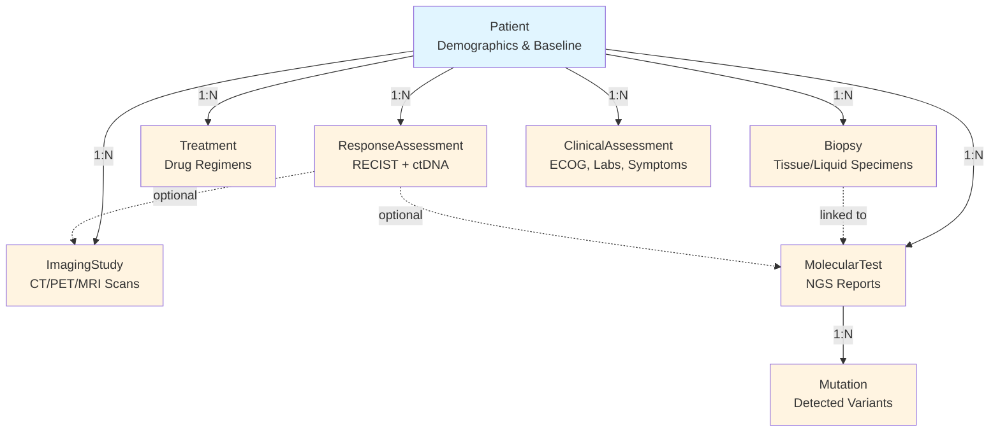

# LinkML Data Modeling Specification
**Project**: EGFR-NSCLC Clinical Decision Support System  
**Version**: 1.0  
**Date**: 2026-04-24

---

## 1. Purpose

Use LinkML to define our clinical data model as a single source of truth that generates:
- SQL database schema
- Python validation classes
- JSON Schema for API contracts
- Documentation with diagrams

**Why LinkML?** Single YAML file → automatic generation of SQL + validation + docs + ontology mappings.

---

## 2. LinkML Deliverables

### 2.1 Input (What We Create)
```
schemas/
├── clinical_model.yaml          # Main schema definition (ONLY file we maintain)
```

### 2.2 Outputs (Auto-Generated)
```
schemas/generated/
├── clinical_model.sql           # SQLite DDL (CREATE TABLE statements)
├── clinical_model.py            # Python dataclasses with validation
├── clinical_model.json          # JSON Schema for API validation
└── docs/
    ├── index.md                 # Class documentation
    ├── Patient.md               # Per-class details
    └── schema_diagram.md        # Entity-relationship diagram
```

### 2.3 Generation Commands
```bash
# Generate SQL schema
gen-sqlddl schemas/clinical_model.yaml > schemas/generated/clinical_model.sql

# Generate Python classes
gen-python schemas/clinical_model.yaml > schemas/generated/clinical_model.py

# Generate JSON Schema
gen-json-schema schemas/clinical_model.yaml > schemas/generated/clinical_model.json

# Generate documentation
gen-markdown schemas/clinical_model.yaml -d schemas/generated/docs/
```

---

## 3. Data Model Overview

### 3.1 Entity Relationship Diagram



### 3.2 Schema Pattern: Galaxy Schema

**Pattern**: Multiple fact tables sharing a common dimension (Patient).

| Component | Description | Examples |
|-----------|-------------|----------|
| **Dimension** (1 row per patient) | Patient demographics & baseline data | Patient |
| **Fact Tables** (N rows per patient) | Time-series events per business process | ImagingStudy, Biopsy, Treatment, ResponseAssessment, ClinicalAssessment |
| **Sub-Facts** (N rows per parent fact) | Normalized children of fact tables | MolecularTest (child of Biopsy), Mutation (child of MolecularTest) |
| **Bridge Table** (Links multiple facts) | Associates multiple fact tables | ResponseAssessment (links Treatment + ImagingStudy + MolecularTest) |

**Why Galaxy Schema?**
- **Galaxy** = Multiple fact tables + shared dimensions (our design: 6 fact tables, 1 Patient dimension)
- **Snowflake** = 1 fact table + normalized dimensions
- **Star** = 1 fact table + denormalized dimensions

Our schema has multiple independent fact tables (ImagingStudy, Biopsy, Treatment, etc.) all sharing the Patient dimension → **Galaxy Schema**. Some fact tables have normalized children (Biopsy → MolecularTest → Mutation), adding snowflake-like hierarchies.

---

## 4. Technical Specification (Plain English)

### 4.1 Patient (Dimension Table)

**Purpose**: Core patient entity with demographics and baseline clinical data.

**Business Rules**:
- One row per patient (primary key: `patient_id`)
- NHS number must be exactly 10 digits
- Age at diagnosis: 0-130 years
- ECOG status at diagnosis: 0-5 (integer scale)
- Smoking status: Never/Former/Current/Unknown
- Pack-years: 0-200 (float)

**Key Fields**:
- Identifiers: `patient_id` (NGDX-XXX format), `nhs_number`
- Demographics: `age_at_diagnosis`, `sex` (Male/Female/Indeterminate), `ethnicity_code`
- Risk factors: `smoking_status`, `pack_years`, `family_history_lung_cancer` (boolean)
- Baseline performance: `ecog_baseline` (0-5)
- Baseline labs: `baseline_egfr` (renal), `baseline_wbc`, `baseline_hemoglobin`, `baseline_platelets`, `baseline_alt`, `baseline_ast` (liver)
- Diagnosis: `diagnosis_date`, `diagnosis_pathway`

**Ontology Mappings**:
- NHS number → SNOMED concept
- Sex → SNOMED 248153007 (Male), 248152002 (Female)
- ECOG status → LOINC 89247-1
- Smoking status → SNOMED 365980008

**Relationships**:
- 1:N to ImagingStudy, Biopsy, MolecularTest, Treatment, ResponseAssessment, ClinicalAssessment

---

### 4.2 ImagingStudy (Fact Table)

**Purpose**: Time-series of imaging studies (CT, PET-CT, MRI) with TNM staging.

**Business Rules**:
- Multiple rows per patient (each scan = 1 row)
- DICOM Study UID must be unique (format: dot-separated numbers, max 64 chars)
- Primary tumor diameter: 0-300 mm
- SUVmax (PET): 0-50 (float)
- TNM staging must follow AJCC 8th edition rules

**Key Fields**:
- Identifiers: `imaging_study_id`, `patient_id` (FK), `study_uid` (DICOM), `accession_number`
- Metadata: `scan_date`, `imaging_modality` (CT/PT/MR/CR/US), `study_description`
- Image references: `dicom_file_path`, `thumbnail_image_path`
- CT parameters: `ct_kvp`, `ct_mas`, `ct_slice_thickness_mm`
- PET parameters: `pet_tracer`, `pet_injected_dose_mbq`, `pet_uptake_time_min`
- Staging: `t_stage` (TX/T0/T1a/T1b/.../T4), `n_stage` (NX/N0/N1/N2/N3), `m_stage` (M0/M1a/M1b/M1c), `ajcc_stage` (IA1/.../IVB)
- Measurements: `primary_tumor_diameter_mm`, `suv_max`
- Brain imaging: `brain_metastasis_present` (boolean), `brain_lesion_count`, `brain_largest_lesion_mm`

**Ontology Mappings**:
- Imaging modality → SNOMED 363679005
- T-stage → SNOMED 399504009
- N-stage → SNOMED 399534004
- M-stage → SNOMED 399387003
- AJCC stage → SNOMED 260998006

**Enums**:
- `ImagingModalityEnum`: CT | PT | MR | CR | US
- `TStageEnum`: TX | T0 | Tis | T1a | T1b | T1c | T2a | T2b | T3 | T4
- `NStageEnum`: NX | N0 | N1 | N2 | N3
- `MStageEnum`: M0 | M1a | M1b | M1c
- `AJCCStageEnum`: Stage_0 | IA1 | IA2 | IA3 | IB | IIA | IIB | IIIA | IIIB | IIIC | IVA | IVB

---

### 4.3 Biopsy (Fact Table)

**Purpose**: Tissue and liquid biopsy procedures with pathology results.

**Business Rules**:
- Multiple rows per patient (initial biopsy + progression biopsies)
- Specimen type: Tissue or Liquid (ctDNA)
- Tumor cellularity: 0-100% (float)
- PD-L1 TPS: 0-100% (integer)

**Key Fields**:
- Identifiers: `biopsy_id`, `patient_id` (FK)
- Procedure: `biopsy_date`, `specimen_type` (Tissue/ctDNA), `biopsy_technique` (EBUS-TBNA/CT-guided/VATS/etc.)
- Location: `biopsy_site_snomed` (code), `biopsy_site_description` (text)
- Tissue specifics: `tissue_specimen_category`, `tissue_preparation_format` (FFPE/frozen), `tissue_fixation_hours`, `tumor_cellularity_percent`, `necrosis_percent`
- Image references: `pathology_slide_image_path`, `pathology_report_pdf_path`
- Liquid biopsy specifics: `blood_tube_type` (K2EDTA/Streck BCT), `blood_collection_volume_ml`, `blood_draw_timestamp`, `time_to_fractionation_hours`, `plasma_volume_ml`, `cfdna_concentration_ng_ul`, `cfdna_total_yield_ng`
- Histology: `histologic_subtype`, `pdl1_tps_percent`, `pdl1_antibody_clone`
- Quality: `specimen_adequacy`, `tissue_sufficiency`

**Ontology Mappings**:
- Biopsy site → SNOMED anatomical codes
- Histologic subtype → ICD-O-3 morphology codes

**Enums**:
- `SpecimenTypeEnum`: Tissue | ctDNA
- `BiopsyTechniqueEnum`: EBUS_TBNA | CT_guided_core_needle | VATS_wedge | etc.
- `HistologyTypeEnum`: Adenocarcinoma_8140_3 | Squamous_cell_8070_3 | etc.

---

### 4.4 MolecularTest (Fact Table)

**Purpose**: NGS test results from tissue or ctDNA.

**Business Rules**:
- Multiple rows per patient (baseline + serial monitoring)
- Must link to source biopsy (optional: may be external test)
- Mean coverage depth minimum: 100x for tissue, 1000x for ctDNA

**Key Fields**:
- Identifiers: `molecular_test_id`, `patient_id` (FK), `biopsy_id` (FK, optional)
- Metadata: `test_date`, `specimen_source` (Tissue/ctDNA), `ngs_panel_name`, `ngs_panel_version`, `ngs_assay_type` (DNA_only/RNA_only/Concurrent)
- QC: `dna_input_mass_ng`, `mean_coverage_depth`, `assay_lod_percent`
- Reports: `ngs_report_pdf_path`, `vcf_file_path`

**Relationships**:
- 1:N to Mutation (one test detects multiple variants)

**Enums**:
- `SpecimenSourceEnum`: Tissue | ctDNA
- `NGSAssayTypeEnum`: DNA_only | RNA_only | Concurrent_DNA_and_RNA

---

### 4.5 Mutation (Normalized Fact Table)

**Purpose**: Individual genomic variants detected in NGS tests.

**Business Rules**:
- One row per mutation per test (normalized to enable time-series queries)
- Gene symbol: uppercase letters/numbers/hyphens only (e.g., EGFR, TP53, MET)
- HGVS notation: must start with "p." (protein) or "c." (cDNA)
- VAF: 0-100% (float)
- Tier classification: AMP/ASCO/CAP 2017 guidelines (Tier I-IV)

**Key Fields**:
- Identifiers: `mutation_id`, `molecular_test_id` (FK), `patient_id` (FK)
- Variant details: `gene_symbol`, `mutation_hgvs` (HGVS notation), `mutation_type`, `mutation_classification` (Tier I/II/III/IV)
- Quantitative: `vaf_percent` (0-100), `tumor_fraction_percent`
- Clinical significance: `actionable_mutation` (boolean), `resistance_mutation` (boolean), `chip_status` (clonal hematopoiesis filter)
- Context: `is_primary_driver` (boolean), `is_acquired_resistance` (boolean), `detection_timepoint` (Baseline/Progression/MRD)

**Ontology Mappings**:
- Gene symbol → FHIR Observation.code
- HGVS notation → FHIR Observation.value

**Enums**:
- `MutationTypeEnum`: Exon_19_deletion | L858R | T790M | C797S | G719X | L861Q | S768I | MET_amplification | BRAF_V600E | KRAS_G12C | etc.
- `VariantTierEnum`: Tier_I | Tier_II | Tier_III | Tier_IV
- `DetectionTimepointEnum`: Baseline | Progression | MRD | Post_treatment

---

### 4.6 Treatment (Fact Table)

**Purpose**: Treatment lines with drug regimens and duration.

**Business Rules**:
- Multiple rows per patient (1st-line, 2nd-line, etc.)
- Treatment line 0 = surgery/radiation, line 1 = 1st systemic therapy, etc.
- Treatment end date can be NULL (ongoing treatment)

**Key Fields**:
- Identifiers: `treatment_id`, `patient_id` (FK)
- Treatment details: `treatment_line` (0-10), `treatment_intent` (Curative/Palliative/Adjuvant), `drug_name`, `drug_dose_mg`, `drug_frequency` (OD/BD/q3w), `drug_route` (Oral/IV)
- Dates: `treatment_start_date`, `treatment_end_date` (NULL if ongoing)
- Context: `mdt_recommendation`, `mdt_date`, `prior_ici_exposure` (boolean), `months_since_last_ici`
- Discontinuation: `discontinuation_reason`

**Ontology Mappings**:
- Treatment intent → SNOMED 363676003
- Drug name → SNOMED drug concepts

**Enums**:
- `TreatmentIntentEnum`: Curative_definitive | Palliative | Adjuvant | Neoadjuvant
- `DoseFrequencyEnum`: OD | BD | TID | q3w | weekly
- `DiscontinuationReasonEnum`: Progression | Toxicity | Patient_choice | Death | Treatment_completion

---

### 4.7 ResponseAssessment (Fact Table)

**Purpose**: Serial treatment response monitoring (RECIST + ctDNA).

**Business Rules**:
- Multiple rows per patient (baseline, follow-ups, progression)
- Can link to imaging study (for RECIST) AND/OR molecular test (for ctDNA VAF)
- RECIST: ≥20% increase + ≥5mm absolute = Progressive Disease
- ctDNA VAF ≥2x nadir = molecular progression warning

**Key Fields**:
- Identifiers: `assessment_id`, `patient_id` (FK), `treatment_id` (FK), `imaging_study_id` (FK, optional), `molecular_test_id` (FK, optional)
- Metadata: `assessment_date`, `assessment_type` (Baseline/Follow_up/Progression)
- RECIST: `recist_response` (CR/PR/SD/PD), `sum_target_lesions_mm`, `percent_change_from_baseline`, `new_lesions_present` (boolean)
- ctDNA: `ctdna_vaf_percent`, `ctdna_mutation_cleared` (boolean), `ctdna_tumor_fraction_percent`
- Clinical: `ecog_status`, `symptom_improvement` (boolean)
- Progression: `progression_detected` (boolean), `progression_type` (Oligoprogression/Systemic/CNS-only), `time_to_progression_months`
- Resistance: `resistance_mutation_detected` (boolean), `resistance_mechanism`, `histologic_transformation` (boolean)

**Ontology Mappings**:
- RECIST response → SNOMED 106244004

**Enums**:
- `RECISTResponseEnum`: CR | PR | SD | PD
- `AssessmentTypeEnum`: Baseline | Follow_up | Progression
- `ProgressionTypeEnum`: Oligoprogression | Systemic_multi_site | CNS_only | Asymptomatic_slow

---

### 4.8 ClinicalAssessment (Fact Table)

**Purpose**: Longitudinal clinical status (ECOG, symptoms, labs).

**Business Rules**:
- Multiple rows per patient (each clinic visit)
- ECOG status can change over time (vs. baseline in Patient table)
- Lab values: reference ranges as per data dictionary

**Key Fields**:
- Identifiers: `assessment_id`, `patient_id` (FK)
- Metadata: `assessment_date`, `visit_type` (Clinic/Phone/Hospitalization)
- Performance: `ecog_status` (0-5)
- Symptoms: `symptoms_coded` (SNOMED codes, multi-value), `symptom_severity_grade` (CTCAE)
- Labs: `wbc`, `hemoglobin`, `platelets`, `neutrophils`, `egfr_value`, `alt`, `ast`

**Ontology Mappings**:
- Symptoms → SNOMED symptom concepts
- Labs → LOINC codes (WBC: 6690-2, Hemoglobin: 718-7, eGFR: 98979-8)

---

## 5. Cross-Cutting Requirements

### 5.1 Identifiers

**Format Requirements**:
- `patient_id`: Pattern `^NGDX-[0-9]{3}$` (e.g., NGDX-001, NGDX-099)
- `nhs_number`: Pattern `^[0-9]{10}$` (exactly 10 digits)
- `study_uid` (DICOM): Pattern `^[0-9.]{1,64}$` (dot-separated numbers)

**Primary Keys**:
- All tables have auto-increment surrogate key `_sk` (e.g., `patient_sk`, `imaging_study_sk`)
- Business keys (e.g., `patient_id`, `nhs_number`) are unique but not primary keys

### 5.2 Dates

**Format**: ISO 8601 (YYYY-MM-DD)

**Range**: 
- Diagnosis date: 1900-01-01 to current date (no future dates)
- All clinical dates must be ≥ diagnosis date

### 5.3 Measurements & Units

| Field | Unit | Range | Validation |
|-------|------|-------|------------|
| Age | years | 0-130 | Integer |
| Pack-years | pack-years | 0-200 | Float |
| VAF | % | 0.0-100.0 | Float, 2 decimals |
| Tumor diameter | mm | 0-300 | Float |
| SUVmax | dimensionless | 0-50 | Float |
| Coverage depth | fold (x) | 0-100000 | Float |
| eGFR | mL/min/1.73m² | 0-200 | Float |
| Hemoglobin | g/L | 0-250 | Float |

### 5.4 Enumerations (Complete List)

All enum values must be explicitly defined in LinkML schema:
- SexEnum, SmokingStatusEnum, ImagingModalityEnum
- TStageEnum, NStageEnum, MStageEnum, AJCCStageEnum
- SpecimenTypeEnum, BiopsyTechniqueEnum, HistologyTypeEnum
- MutationTypeEnum, VariantTierEnum, DetectionTimepointEnum
- TreatmentIntentEnum, DoseFrequencyEnum, DiscontinuationReasonEnum
- RECISTResponseEnum, AssessmentTypeEnum, ProgressionTypeEnum

### 5.5 Ontology Mappings Priority

**Must map**:
- Demographics: sex, ethnicity, smoking status
- Clinical measurements: ECOG, labs (LOINC), TNM staging (SNOMED)
- Histology: ICD-O-3 morphology codes
- Mutations: HGVS notation (FHIR Observation)

**Optional** (future enhancement):
- Symptoms → SNOMED
- Drugs → RxNorm
- Imaging → DICOM ontology

---

## 6. Integration with System

### 6.1 Workflow

```
LinkML Schema (YAML)
    ↓ gen-sqlddl
SQLite DDL → Create Database
    ↓
Load Baseline Data (5 patients)
    ↓
Load Time-Series Data (5 patients)
    ↓
FastAPI Backend (uses generated Python classes)
    ↓
React Dashboard
```

### 6.2 File Structure

```
link_ml/
├── schemas/
│   ├── clinical_model.yaml       # MAIN SOURCE OF TRUTH
│   └── generated/
│       ├── clinical_model.sql    # → backend/clinical_data.db
│       ├── clinical_model.py     # → backend/app/schemas.py
│       └── docs/index.md         # → documentation
├── backend/
│   └── clinical_data.db          # Created from generated SQL
└── scripts/
    ├── 01_generate_artifacts.sh  # Run LinkML generators
    └── 02_create_database.py     # Execute generated SQL
```

---

## 7. Validation Requirements

### 7.1 Schema-Level Validation

LinkML built-in checks:
- Required fields are not NULL
- Numeric fields within min/max ranges
- Enum fields match allowed values
- String fields match regex patterns
- Foreign key references exist

### 7.2 Business Logic Validation (Future)

Custom rules to implement:
- TNM stage consistency (e.g., Stage IVB requires M1b or M1c)
- Date ordering (scan_date ≥ diagnosis_date)
- Treatment line sequence (no gaps: 1, 2, 3, not 1, 3, 5)
- RECIST PD criteria (≥20% increase AND ≥5mm absolute)

---

## 8. Success Criteria

- ✅ LinkML schema `clinical_model.yaml` covers all 8 entity types
- ✅ All 142 variables from data dictionary mapped to schema fields
- ✅ Generated SQL creates galaxy schema matching SYSTEM_SPEC.md
- ✅ Generated Python classes have proper type hints and validation
- ✅ Sample data validates without errors
- ✅ Auto-generated documentation is complete with ER diagram

---

## 9. Next Steps

1. **Create schema file**: `schemas/clinical_model.yaml` with 8 classes defined above
2. **Generate artifacts**: Run LinkML generators to create SQL/Python/JSON/docs
3. **Create database**: Execute generated SQL DDL to create SQLite database
4. **Validate**: Test with sample patient data (NGDX-001)
5. **Iterate**: Fix any validation errors, regenerate artifacts

**Estimated effort**: 1-2 days to complete LinkML schema + artifact generation.