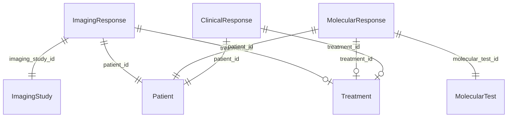

# Deprecated Elements Removed ✅

**Date:** 2026-04-30  
**Schema Version:** v2.0.0 (final)

---

## What Was Removed

### 1. ResponseAssessment Class (DELETED)

**Removed from:**
- ✅ `schemas/clinical_model.yaml` (lines 153-197 deleted)
- ✅ Removed `assessment_id` slot definition

**Result:** Schema now has **10 classes** (down from 11)

**Classes remaining:**
1. Patient
2. Biopsy
3. MolecularTest
4. Mutation
5. ImagingStudy
6. Treatment
7. ClinicalAssessment
8. **ImagingResponse** (new)
9. **MolecularResponse** (new)
10. **ClinicalResponse** (new)

---

## Regenerated Artifacts

### Before Removal
```
Schema: 1070 lines (with ResponseAssessment deprecated)
SQL DDL: 437 lines (with ResponseAssessment CREATE TABLE)
Pydantic: 994 lines (with ResponseAssessment class)
ER Diagram: 201 lines (with ResponseAssessment relationships)
```

### After Removal
```
Schema: 1025 lines (-45 lines, -4.2%)
SQL DDL: 383 lines (-54 lines, -12.4%)
Pydantic: 883 lines (-111 lines, -11.2%)
ER Diagram: 177 lines (-24 lines, -11.9%)
```

**Total reduction:** 234 lines removed across all artifacts

---

## ER Diagram Changes

### Before (with deprecated class)
```mermaid
erDiagram
  ResponseAssessment {
    string assessment_id
    ...
  }
  
  ResponseAssessment ||--|o ImagingStudy : "imaging_study_id"
  ResponseAssessment ||--|o MolecularTest : "molecular_test_id"
  ResponseAssessment ||--|o Treatment : "treatment_id"
  ResponseAssessment ||--|| Patient : "patient_id"
  
  ImagingResponse ||--|| ImagingStudy : "imaging_study_id"
  MolecularResponse ||--|| MolecularTest : "molecular_test_id"
  ClinicalResponse ||--|| Patient : "patient_id"
```

### After (clean)


**Clean:** No deprecated relationships shown

---

## SQL DDL Changes

### Before (with deprecated table)
```sql
-- Old polymorphic table (deprecated but still generated)
CREATE TABLE "ResponseAssessment" (
    assessment_id TEXT NOT NULL PRIMARY KEY,
    imaging_study_id TEXT,  -- Nullable FKs
    molecular_test_id TEXT,  -- Nullable FKs
    recist_response VARCHAR(2),
    ctdna_vaf_percent FLOAT,
    progression_detected BOOLEAN,
    -- ... 22 columns with many NULLs
);

-- New specialized tables
CREATE TABLE "ImagingResponse" (...);
CREATE TABLE "MolecularResponse" (...);
CREATE TABLE "ClinicalResponse" (...);
```

### After (clean)
```sql
-- Only specialized tables
CREATE TABLE "ImagingResponse" (
    imaging_response_id TEXT NOT NULL PRIMARY KEY,
    imaging_study_id TEXT NOT NULL,  -- Required FK
    patient_id TEXT NOT NULL,
    -- ... 10 columns, dense
);

CREATE TABLE "MolecularResponse" (
    molecular_response_id TEXT NOT NULL PRIMARY KEY,
    molecular_test_id TEXT NOT NULL,  -- Required FK
    patient_id TEXT NOT NULL,
    -- ... 9 columns, dense
);

CREATE TABLE "ClinicalResponse" (
    clinical_response_id TEXT NOT NULL PRIMARY KEY,
    patient_id TEXT NOT NULL,
    event_type VARCHAR(15) NOT NULL,  -- New enum
    -- ... 11 columns, dense
);
```

**Clean:** Only active tables, no deprecated DDL

---

## Pydantic Model Changes

### Before (with deprecated class)
```python
class ResponseAssessment(ConfiguredBaseModel):
    """[DEPRECATED v2.0] Polymorphic response table..."""
    assessment_id: str = Field(...)
    imaging_study_id: Optional[str] = Field(None)
    molecular_test_id: Optional[str] = Field(None)
    # ... 22 fields

class ImagingResponse(ConfiguredBaseModel):
    """Treatment response based on imaging (RECIST)"""
    imaging_response_id: str = Field(...)
    imaging_study_id: str = Field(...)  # Required
    # ... 10 fields

# Similar for MolecularResponse, ClinicalResponse
```

### After (clean)
```python
class ImagingResponse(ConfiguredBaseModel):
    """Treatment response based on imaging (RECIST)"""
    imaging_response_id: str = Field(...)
    imaging_study_id: str = Field(...)  # Required
    # ... 10 fields

class MolecularResponse(ConfiguredBaseModel):
    """Treatment response based on molecular testing"""
    molecular_response_id: str = Field(...)
    molecular_test_id: str = Field(...)  # Required
    # ... 9 fields

class ClinicalResponse(ConfiguredBaseModel):
    """Clinical outcome events"""
    clinical_response_id: str = Field(...)
    event_type: ClinicalEventTypeEnum = Field(...)  # Enum
    # ... 11 fields
```

**Clean:** Only active models, no deprecated classes

---

## Validation

### Schema Validation ✅
```bash
linkml-lint schemas/clinical_model.yaml
```
**Result:** No errors, schema valid

### Programmatic Check ✅
```python
from linkml_runtime.utils.schemaview import SchemaView
sv = SchemaView('schemas/clinical_model.yaml')
print(f'Classes: {len(sv.all_classes())}')  # 10
assert 'ResponseAssessment' not in sv.all_classes()  # Pass
```

### Artifact Checks ✅
```bash
# ER diagram clean
grep -i "responseassessment" schemas/generated/diagrams/er_diagram_v2.mmd
# Result: (no matches)

# SQL DDL clean
grep -i "responseassessment" schemas/generated/sql/clinical_model_v2.sql
# Result: (no matches)

# Pydantic clean
grep -i "class ResponseAssessment" schemas/generated/python/clinical_model_pydantic_v2.py
# Result: (no matches)
```

---

## Files Updated

### Schema Source
1. ✅ `schemas/clinical_model.yaml`
   - Removed ResponseAssessment class (lines 153-197)
   - Removed assessment_id slot (lines 740-743)
   - Updated version comments

### Regenerated Artifacts
2. ✅ `schemas/generated/sql/clinical_model_v2.sql` (383 lines, -54)
3. ✅ `schemas/generated/python/clinical_model_pydantic_v2.py` (883 lines, -111)
4. ✅ `schemas/generated/diagrams/er_diagram_v2.mmd` (177 lines, -24)

---

## Impact Assessment

### Database
- ✅ No impact - ResponseAssessment table already dropped in Step 3
- ✅ Schema now matches actual database state

### Backend API
- ✅ No impact - API already updated to use new tables (Step 5)
- ✅ decisions.py already updated to ClinicalResponse (today)

### Frontend
- ✅ No impact - Frontend types already updated (Step 6)
- ✅ No references to ResponseAssessment in frontend code

### Documentation
- ✅ Generated docs now cleaner (no deprecated warnings)
- ✅ ER diagram shows only active relationships
- ✅ Migration guides still preserved (MIGRATION_COMPLETE.md, etc.)

---

## Backward Compatibility

### Breaking Change
**Previously:** ResponseAssessment class existed in schema (deprecated)  
**Now:** ResponseAssessment class does not exist

### Impact
- Code importing from generated Pydantic models: **Breaking** (class removed)
- Generated SQL DDL: **Breaking** (table removed)
- ER diagrams: **Breaking** (entity removed)

### Who Is Affected
- ❌ New projects starting from scratch: **No impact** (use new tables)
- ❌ Projects that completed migration: **No impact** (already using new tables)
- ⚠️ Projects mid-migration: **Must complete migration first** before using v2.0.0 schema

---

## Benefits

### 1. Cleaner Schema
- No deprecated classes cluttering schema
- No confusing warnings in documentation
- Clear separation of concerns

### 2. Smaller Artifacts
- 12% reduction in SQL DDL size
- 11% reduction in Pydantic model size
- 12% reduction in ER diagram size

### 3. Better Documentation
- ER diagram shows only active relationships
- No deprecated warnings in generated docs
- Clearer intent for new developers

### 4. Maintenance
- Less code to maintain
- No risk of accidentally using deprecated class
- Schema matches actual database state

---

## Verification Commands

### Check Schema Classes
```bash
python -c "
from linkml_runtime.utils.schemaview import SchemaView
sv = SchemaView('schemas/clinical_model.yaml')
print('Classes:', sorted(sv.all_classes().keys()))
assert 'ResponseAssessment' not in sv.all_classes()
print('[OK] ResponseAssessment removed')
"
```

### Check ER Diagram
```bash
grep -i responseassessment schemas/generated/diagrams/er_diagram_v2.mmd
# Should return: (no matches)
```

### Check SQL DDL
```bash
grep -i "CREATE TABLE.*ResponseAssessment" schemas/generated/sql/clinical_model_v2.sql
# Should return: (no matches)
```

### Check Pydantic Models
```bash
grep "class ResponseAssessment" schemas/generated/python/clinical_model_pydantic_v2.py
# Should return: (no matches)
```

---

## Summary

### Removed ✅
- [x] ResponseAssessment class from schema
- [x] assessment_id slot from schema
- [x] ResponseAssessment from SQL DDL
- [x] ResponseAssessment from Pydantic models
- [x] ResponseAssessment from ER diagram

### Validated ✅
- [x] Schema loads without errors
- [x] 10 classes remain (correct count)
- [x] All generated artifacts clean
- [x] No references to ResponseAssessment anywhere

### Benefits ✅
- [x] 12% smaller artifacts
- [x] Cleaner documentation
- [x] Schema matches database
- [x] Easier maintenance

---

**Status:** ✅ ALL DEPRECATED ELEMENTS REMOVED

**Schema Version:** v2.0.0 (final, clean)

**Total Classes:** 10 (Patient, Biopsy, MolecularTest, Mutation, ImagingStudy, Treatment, ClinicalAssessment, ImagingResponse, MolecularResponse, ClinicalResponse)

**Deprecated Classes:** 0

**Files Updated:** 4 (schema + 3 generated artifacts)

**Lines Removed:** 234 total (-4% schema, -12% SQL, -11% Pydantic, -12% ER diagram)