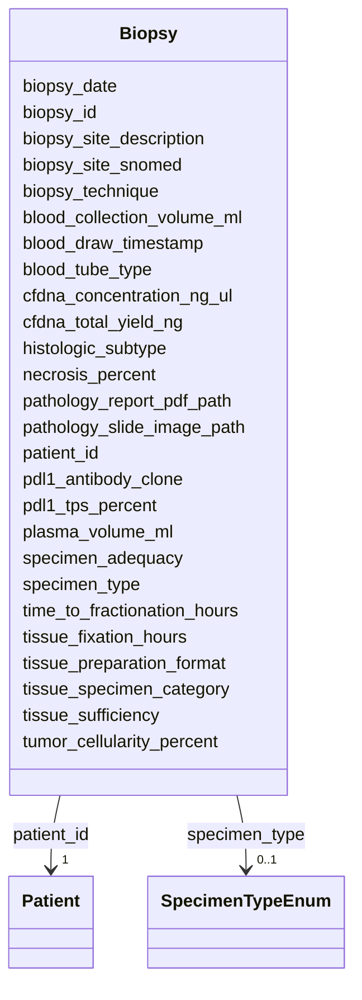

```mermaid
 classDiagram
    class Biopsy
    click Biopsy href "../Biopsy"
      Biopsy : biopsy_date
        
      Biopsy : biopsy_id
        
      Biopsy : biopsy_site_description
        
      Biopsy : biopsy_site_snomed
        
      Biopsy : biopsy_technique
        
      Biopsy : blood_collection_volume_ml
        
      Biopsy : blood_draw_timestamp
        
      Biopsy : blood_tube_type
        
      Biopsy : cfdna_concentration_ng_ul
        
      Biopsy : cfdna_total_yield_ng
        
      Biopsy : histologic_subtype
        
      Biopsy : necrosis_percent
        
      Biopsy : pathology_report_pdf_path
        
      Biopsy : pathology_slide_image_path
        
      Biopsy : patient_id
        
          
    
        
        
        Biopsy --> "1" Patient : patient_id
        click Patient href "../Patient"
    

        
      Biopsy : pdl1_antibody_clone
        
      Biopsy : pdl1_tps_percent
        
      Biopsy : plasma_volume_ml
        
      Biopsy : specimen_adequacy
        
      Biopsy : specimen_type
        
          
    
        
        
        Biopsy --> "0..1" SpecimenTypeEnum : specimen_type
        click SpecimenTypeEnum href "../SpecimenTypeEnum"
    

        
      Biopsy : time_to_fractionation_hours
        
      Biopsy : tissue_fixation_hours
        
      Biopsy : tissue_preparation_format
        
      Biopsy : tissue_specimen_category
        
      Biopsy : tissue_sufficiency
        
      Biopsy : tumor_cellularity_percent
        
      
```
