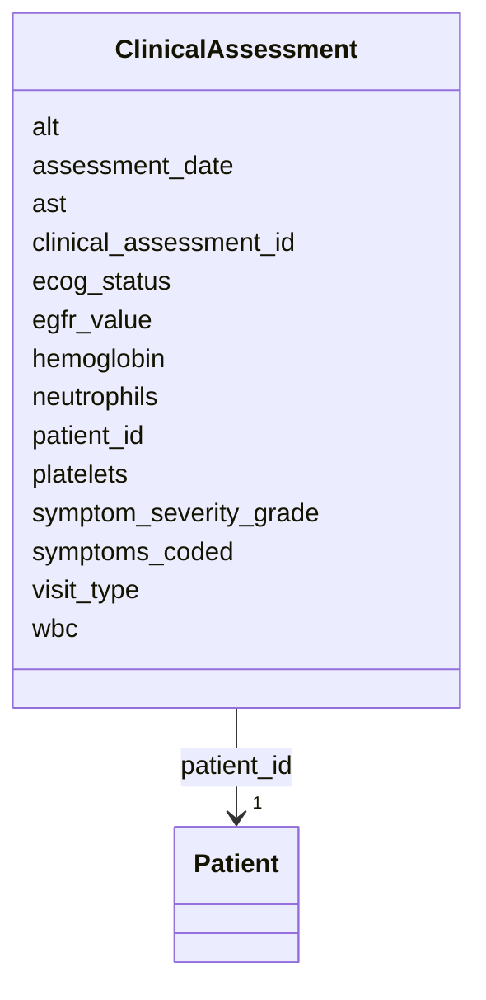

```mermaid
 classDiagram
    class ClinicalAssessment
    click ClinicalAssessment href "../ClinicalAssessment"
      ClinicalAssessment : alt
        
      ClinicalAssessment : assessment_date
        
      ClinicalAssessment : ast
        
      ClinicalAssessment : clinical_assessment_id
        
      ClinicalAssessment : ecog_status
        
      ClinicalAssessment : egfr_value
        
      ClinicalAssessment : hemoglobin
        
      ClinicalAssessment : neutrophils
        
      ClinicalAssessment : patient_id
        
          
    
        
        
        ClinicalAssessment --> "1" Patient : patient_id
        click Patient href "../Patient"
    

        
      ClinicalAssessment : platelets
        
      ClinicalAssessment : symptom_severity_grade
        
      ClinicalAssessment : symptoms_coded
        
      ClinicalAssessment : visit_type
        
      ClinicalAssessment : wbc
        
      
```
