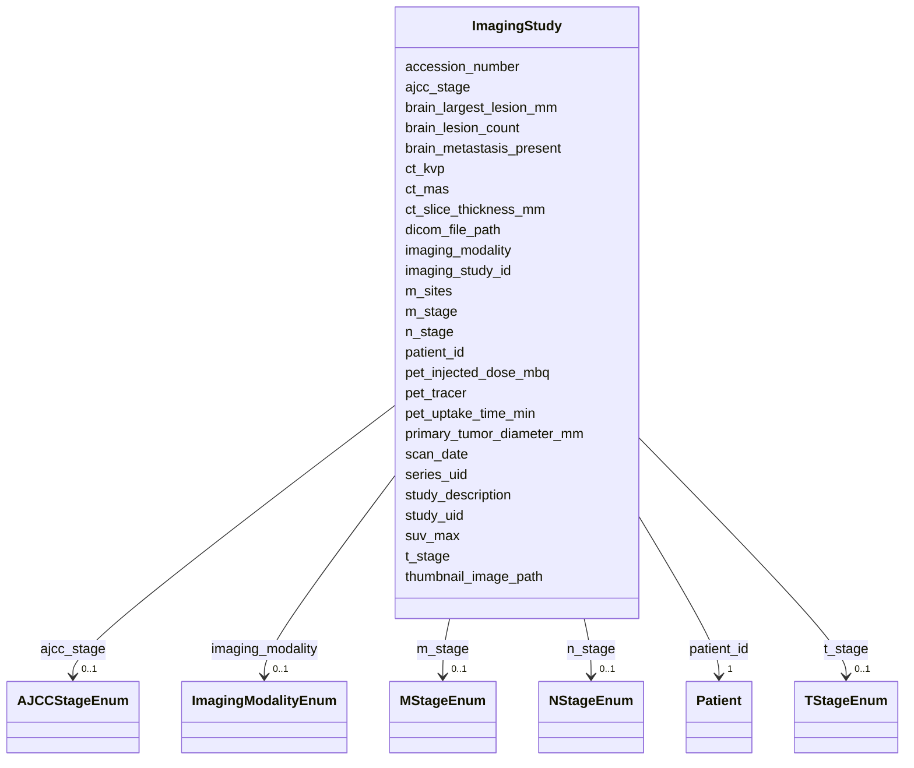

```mermaid
 classDiagram
    class ImagingStudy
    click ImagingStudy href "../ImagingStudy"
      ImagingStudy : accession_number
        
      ImagingStudy : ajcc_stage
        
          
    
        
        
        ImagingStudy --> "0..1" AJCCStageEnum : ajcc_stage
        click AJCCStageEnum href "../AJCCStageEnum"
    

        
      ImagingStudy : brain_largest_lesion_mm
        
      ImagingStudy : brain_lesion_count
        
      ImagingStudy : brain_metastasis_present
        
      ImagingStudy : ct_kvp
        
      ImagingStudy : ct_mas
        
      ImagingStudy : ct_slice_thickness_mm
        
      ImagingStudy : dicom_file_path
        
      ImagingStudy : imaging_modality
        
          
    
        
        
        ImagingStudy --> "0..1" ImagingModalityEnum : imaging_modality
        click ImagingModalityEnum href "../ImagingModalityEnum"
    

        
      ImagingStudy : imaging_study_id
        
      ImagingStudy : m_sites
        
      ImagingStudy : m_stage
        
          
    
        
        
        ImagingStudy --> "0..1" MStageEnum : m_stage
        click MStageEnum href "../MStageEnum"
    

        
      ImagingStudy : n_stage
        
          
    
        
        
        ImagingStudy --> "0..1" NStageEnum : n_stage
        click NStageEnum href "../NStageEnum"
    

        
      ImagingStudy : patient_id
        
          
    
        
        
        ImagingStudy --> "1" Patient : patient_id
        click Patient href "../Patient"
    

        
      ImagingStudy : pet_injected_dose_mbq
        
      ImagingStudy : pet_tracer
        
      ImagingStudy : pet_uptake_time_min
        
      ImagingStudy : primary_tumor_diameter_mm
        
      ImagingStudy : scan_date
        
      ImagingStudy : series_uid
        
      ImagingStudy : study_description
        
      ImagingStudy : study_uid
        
      ImagingStudy : suv_max
        
      ImagingStudy : t_stage
        
          
    
        
        
        ImagingStudy --> "0..1" TStageEnum : t_stage
        click TStageEnum href "../TStageEnum"
    

        
      ImagingStudy : thumbnail_image_path
        
      
```
