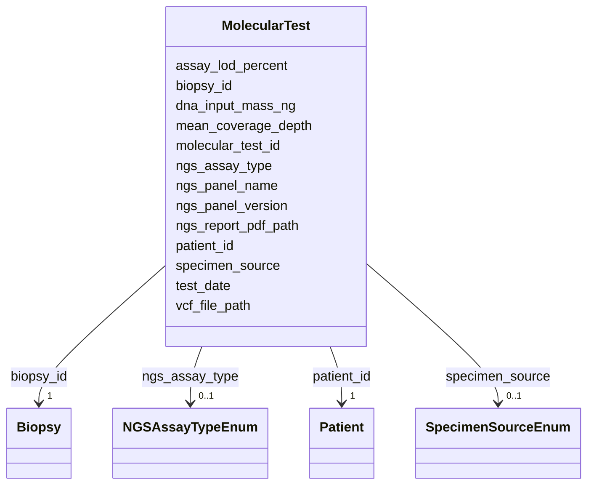

```mermaid
 classDiagram
    class MolecularTest
    click MolecularTest href "../MolecularTest"
      MolecularTest : assay_lod_percent
        
      MolecularTest : biopsy_id
        
          
    
        
        
        MolecularTest --> "1" Biopsy : biopsy_id
        click Biopsy href "../Biopsy"
    

        
      MolecularTest : dna_input_mass_ng
        
      MolecularTest : mean_coverage_depth
        
      MolecularTest : molecular_test_id
        
      MolecularTest : ngs_assay_type
        
          
    
        
        
        MolecularTest --> "0..1" NGSAssayTypeEnum : ngs_assay_type
        click NGSAssayTypeEnum href "../NGSAssayTypeEnum"
    

        
      MolecularTest : ngs_panel_name
        
      MolecularTest : ngs_panel_version
        
      MolecularTest : ngs_report_pdf_path
        
      MolecularTest : patient_id
        
          
    
        
        
        MolecularTest --> "1" Patient : patient_id
        click Patient href "../Patient"
    

        
      MolecularTest : specimen_source
        
          
    
        
        
        MolecularTest --> "0..1" SpecimenSourceEnum : specimen_source
        click SpecimenSourceEnum href "../SpecimenSourceEnum"
    

        
      MolecularTest : test_date
        
      MolecularTest : vcf_file_path
        
      
```
