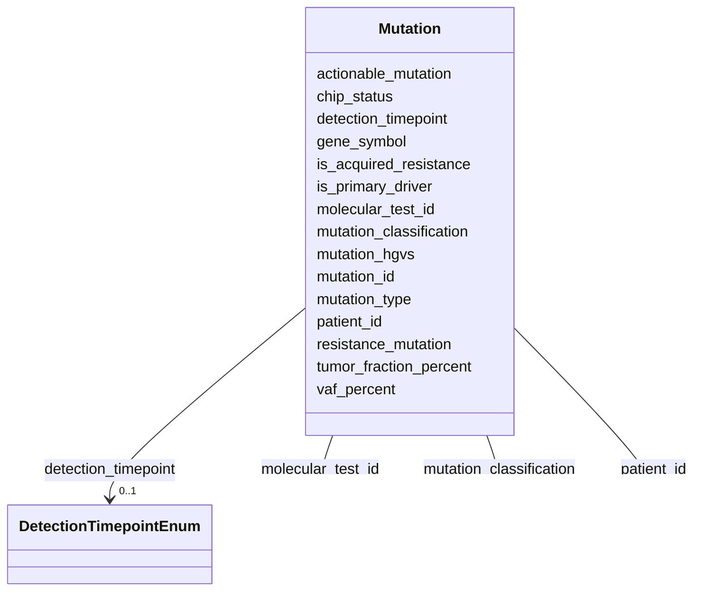

```mermaid
 classDiagram
    class Mutation
    click Mutation href "../Mutation"
      Mutation : actionable_mutation
        
      Mutation : chip_status
        
      Mutation : detection_timepoint
        
          
    
        
        
        Mutation --> "0..1" DetectionTimepointEnum : detection_timepoint
        click DetectionTimepointEnum href "../DetectionTimepointEnum"
    

        
      Mutation : gene_symbol
        
      Mutation : is_acquired_resistance
        
      Mutation : is_primary_driver
        
      Mutation : molecular_test_id
        
          
    
        
        
        Mutation --> "1" MolecularTest : molecular_test_id
        click MolecularTest href "../MolecularTest"
    

        
      Mutation : mutation_classification
        
          
    
        
        
        Mutation --> "0..1" VariantTierEnum : mutation_classification
        click VariantTierEnum href "../VariantTierEnum"
    

        
      Mutation : mutation_hgvs
        
      Mutation : mutation_id
        
      Mutation : mutation_type
        
      Mutation : patient_id
        
          
    
        
        
        Mutation --> "1" Patient : patient_id
        click Patient href "../Patient"
    

        
      Mutation : resistance_mutation
        
      Mutation : tumor_fraction_percent
        
      Mutation : vaf_percent
        
      
```
