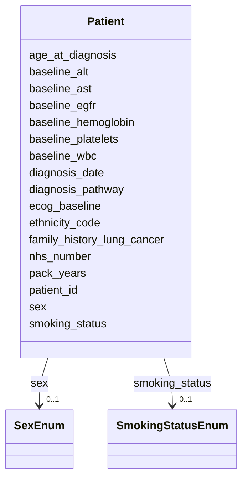

```mermaid
 classDiagram
    class Patient
    click Patient href "../Patient"
      Patient : age_at_diagnosis
        
      Patient : baseline_alt
        
      Patient : baseline_ast
        
      Patient : baseline_egfr
        
      Patient : baseline_hemoglobin
        
      Patient : baseline_platelets
        
      Patient : baseline_wbc
        
      Patient : diagnosis_date
        
      Patient : diagnosis_pathway
        
      Patient : ecog_baseline
        
      Patient : ethnicity_code
        
      Patient : family_history_lung_cancer
        
      Patient : nhs_number
        
      Patient : pack_years
        
      Patient : patient_id
        
      Patient : sex
        
          
    
        
        
        Patient --> "0..1" SexEnum : sex
        click SexEnum href "../SexEnum"
    

        
      Patient : smoking_status
        
          
    
        
        
        Patient --> "0..1" SmokingStatusEnum : smoking_status
        click SmokingStatusEnum href "../SmokingStatusEnum"
    

        
      
```
