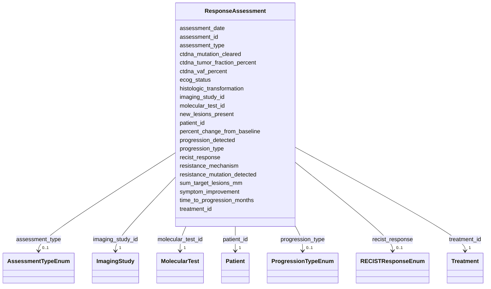

```mermaid
 classDiagram
    class ResponseAssessment
    click ResponseAssessment href "../ResponseAssessment"
      ResponseAssessment : assessment_date
        
      ResponseAssessment : assessment_id
        
      ResponseAssessment : assessment_type
        
          
    
        
        
        ResponseAssessment --> "0..1" AssessmentTypeEnum : assessment_type
        click AssessmentTypeEnum href "../AssessmentTypeEnum"
    

        
      ResponseAssessment : ctdna_mutation_cleared
        
      ResponseAssessment : ctdna_tumor_fraction_percent
        
      ResponseAssessment : ctdna_vaf_percent
        
      ResponseAssessment : ecog_status
        
      ResponseAssessment : histologic_transformation
        
      ResponseAssessment : imaging_study_id
        
          
    
        
        
        ResponseAssessment --> "1" ImagingStudy : imaging_study_id
        click ImagingStudy href "../ImagingStudy"
    

        
      ResponseAssessment : molecular_test_id
        
          
    
        
        
        ResponseAssessment --> "1" MolecularTest : molecular_test_id
        click MolecularTest href "../MolecularTest"
    

        
      ResponseAssessment : new_lesions_present
        
      ResponseAssessment : patient_id
        
          
    
        
        
        ResponseAssessment --> "1" Patient : patient_id
        click Patient href "../Patient"
    

        
      ResponseAssessment : percent_change_from_baseline
        
      ResponseAssessment : progression_detected
        
      ResponseAssessment : progression_type
        
          
    
        
        
        ResponseAssessment --> "0..1" ProgressionTypeEnum : progression_type
        click ProgressionTypeEnum href "../ProgressionTypeEnum"
    

        
      ResponseAssessment : recist_response
        
          
    
        
        
        ResponseAssessment --> "0..1" RECISTResponseEnum : recist_response
        click RECISTResponseEnum href "../RECISTResponseEnum"
    

        
      ResponseAssessment : resistance_mechanism
        
      ResponseAssessment : resistance_mutation_detected
        
      ResponseAssessment : sum_target_lesions_mm
        
      ResponseAssessment : symptom_improvement
        
      ResponseAssessment : time_to_progression_months
        
      ResponseAssessment : treatment_id
        
          
    
        
        
        ResponseAssessment --> "1" Treatment : treatment_id
        click Treatment href "../Treatment"
    

        
      
```
