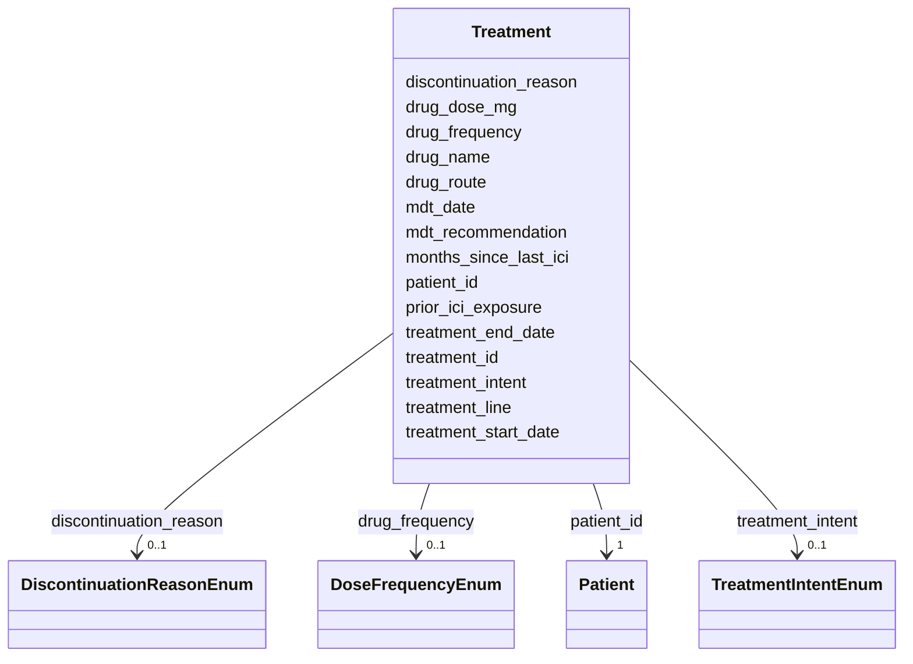

```mermaid
 classDiagram
    class Treatment
    click Treatment href "../Treatment"
      Treatment : discontinuation_reason
        
          
    
        
        
        Treatment --> "0..1" DiscontinuationReasonEnum : discontinuation_reason
        click DiscontinuationReasonEnum href "../DiscontinuationReasonEnum"
    

        
      Treatment : drug_dose_mg
        
      Treatment : drug_frequency
        
          
    
        
        
        Treatment --> "0..1" DoseFrequencyEnum : drug_frequency
        click DoseFrequencyEnum href "../DoseFrequencyEnum"
    

        
      Treatment : drug_name
        
      Treatment : drug_route
        
      Treatment : mdt_date
        
      Treatment : mdt_recommendation
        
      Treatment : months_since_last_ici
        
      Treatment : patient_id
        
          
    
        
        
        Treatment --> "1" Patient : patient_id
        click Patient href "../Patient"
    

        
      Treatment : prior_ici_exposure
        
      Treatment : treatment_end_date
        
      Treatment : treatment_id
        
      Treatment : treatment_intent
        
          
    
        
        
        Treatment --> "0..1" TreatmentIntentEnum : treatment_intent
        click TreatmentIntentEnum href "../TreatmentIntentEnum"
    

        
      Treatment : treatment_line
        
      Treatment : treatment_start_date
        
      
```
