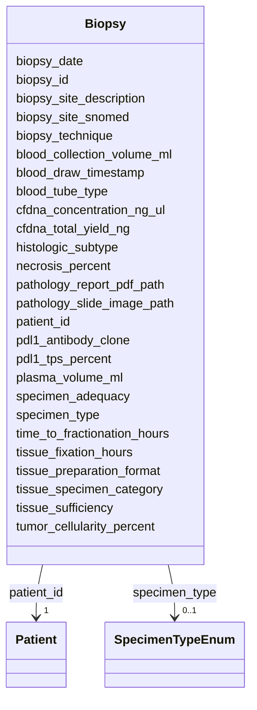

# Class: Biopsy 


_Tissue or liquid biopsy procedure - multiple rows per patient_


URI: [clinical_model:Biopsy](https://uk-cpi.com/clinical_model/Biopsy)





<!-- no inheritance hierarchy -->

## Slots

| Name | Cardinality and Range | Description | Inheritance |
| ---  | --- | --- | --- |
| [biopsy_id](biopsy_id.md) | 1 <br/> [String](String.md) |  | direct |
| [patient_id](patient_id.md) | 1 <br/> [Patient](Patient.md) |  | direct |
| [biopsy_date](biopsy_date.md) | 1 <br/> [Date](Date.md) |  | direct |
| [specimen_type](specimen_type.md) | 0..1 <br/> [SpecimenTypeEnum](SpecimenTypeEnum.md) |  | direct |
| [biopsy_technique](biopsy_technique.md) | 0..1 <br/> [String](String.md) |  | direct |
| [biopsy_site_snomed](biopsy_site_snomed.md) | 0..1 <br/> [String](String.md) |  | direct |
| [biopsy_site_description](biopsy_site_description.md) | 0..1 <br/> [String](String.md) |  | direct |
| [tissue_specimen_category](tissue_specimen_category.md) | 0..1 <br/> [String](String.md) |  | direct |
| [tissue_preparation_format](tissue_preparation_format.md) | 0..1 <br/> [String](String.md) |  | direct |
| [tissue_fixation_hours](tissue_fixation_hours.md) | 0..1 <br/> [Float](Float.md) |  | direct |
| [tumor_cellularity_percent](tumor_cellularity_percent.md) | 0..1 <br/> [Float](Float.md) |  | direct |
| [necrosis_percent](necrosis_percent.md) | 0..1 <br/> [Float](Float.md) |  | direct |
| [pathology_slide_image_path](pathology_slide_image_path.md) | 0..1 <br/> [String](String.md) |  | direct |
| [pathology_report_pdf_path](pathology_report_pdf_path.md) | 0..1 <br/> [String](String.md) |  | direct |
| [blood_tube_type](blood_tube_type.md) | 0..1 <br/> [String](String.md) |  | direct |
| [blood_collection_volume_ml](blood_collection_volume_ml.md) | 0..1 <br/> [Float](Float.md) |  | direct |
| [blood_draw_timestamp](blood_draw_timestamp.md) | 0..1 <br/> [Datetime](Datetime.md) |  | direct |
| [time_to_fractionation_hours](time_to_fractionation_hours.md) | 0..1 <br/> [Float](Float.md) |  | direct |
| [plasma_volume_ml](plasma_volume_ml.md) | 0..1 <br/> [Float](Float.md) |  | direct |
| [cfdna_concentration_ng_ul](cfdna_concentration_ng_ul.md) | 0..1 <br/> [Float](Float.md) |  | direct |
| [cfdna_total_yield_ng](cfdna_total_yield_ng.md) | 0..1 <br/> [Float](Float.md) |  | direct |
| [histologic_subtype](histologic_subtype.md) | 0..1 <br/> [String](String.md) |  | direct |
| [pdl1_tps_percent](pdl1_tps_percent.md) | 0..1 <br/> [Integer](Integer.md) |  | direct |
| [pdl1_antibody_clone](pdl1_antibody_clone.md) | 0..1 <br/> [String](String.md) |  | direct |
| [specimen_adequacy](specimen_adequacy.md) | 0..1 <br/> [String](String.md) |  | direct |
| [tissue_sufficiency](tissue_sufficiency.md) | 0..1 <br/> [String](String.md) |  | direct |


## Usages

| used by | used in | type | used |
| ---  | --- | --- | --- |
| [MolecularTest](MolecularTest.md) | [biopsy_id](biopsy_id.md) | range | [Biopsy](Biopsy.md) |


## Identifier and Mapping Information


### Schema Source


* from schema: https://ngdx.org/clinical_model


## Mappings

| Mapping Type | Mapped Value |
| ---  | ---  |
| self | clinical_model:Biopsy |
| native | clinical_model:Biopsy |


## LinkML Source

<!-- TODO: investigate https://stackoverflow.com/questions/37606292/how-to-create-tabbed-code-blocks-in-mkdocs-or-sphinx -->

### Direct

<details>
```yaml
name: Biopsy
description: Tissue or liquid biopsy procedure - multiple rows per patient
from_schema: https://ngdx.org/clinical_model
rank: 1000
slots:
- biopsy_id
- patient_id
- biopsy_date
- specimen_type
- biopsy_technique
- biopsy_site_snomed
- biopsy_site_description
- tissue_specimen_category
- tissue_preparation_format
- tissue_fixation_hours
- tumor_cellularity_percent
- necrosis_percent
- pathology_slide_image_path
- pathology_report_pdf_path
- blood_tube_type
- blood_collection_volume_ml
- blood_draw_timestamp
- time_to_fractionation_hours
- plasma_volume_ml
- cfdna_concentration_ng_ul
- cfdna_total_yield_ng
- histologic_subtype
- pdl1_tps_percent
- pdl1_antibody_clone
- specimen_adequacy
- tissue_sufficiency
slot_usage:
  biopsy_id:
    name: biopsy_id
    range: string
  patient_id:
    name: patient_id
    identifier: false

```
</details>

### Induced

<details>
```yaml
name: Biopsy
description: Tissue or liquid biopsy procedure - multiple rows per patient
from_schema: https://ngdx.org/clinical_model
rank: 1000
slot_usage:
  biopsy_id:
    name: biopsy_id
    range: string
  patient_id:
    name: patient_id
    identifier: false
attributes:
  biopsy_id:
    name: biopsy_id
    from_schema: https://ngdx.org/clinical_model
    rank: 1000
    identifier: true
    alias: biopsy_id
    owner: Biopsy
    domain_of:
    - Biopsy
    - MolecularTest
    range: string
    required: true
  patient_id:
    name: patient_id
    from_schema: https://ngdx.org/clinical_model
    rank: 1000
    identifier: false
    alias: patient_id
    owner: Biopsy
    domain_of:
    - Patient
    - Biopsy
    - Treatment
    - ResponseAssessment
    - ClinicalAssessment
    - ImagingStudy
    range: Patient
    required: true
    pattern: ^NGDX-[0-9]{3}$
  biopsy_date:
    name: biopsy_date
    from_schema: https://ngdx.org/clinical_model
    rank: 1000
    alias: biopsy_date
    owner: Biopsy
    domain_of:
    - Biopsy
    range: date
    required: true
  specimen_type:
    name: specimen_type
    from_schema: https://ngdx.org/clinical_model
    rank: 1000
    alias: specimen_type
    owner: Biopsy
    domain_of:
    - Biopsy
    range: SpecimenTypeEnum
  biopsy_technique:
    name: biopsy_technique
    from_schema: https://ngdx.org/clinical_model
    rank: 1000
    alias: biopsy_technique
    owner: Biopsy
    domain_of:
    - Biopsy
    range: string
  biopsy_site_snomed:
    name: biopsy_site_snomed
    from_schema: https://ngdx.org/clinical_model
    rank: 1000
    alias: biopsy_site_snomed
    owner: Biopsy
    domain_of:
    - Biopsy
    range: string
  biopsy_site_description:
    name: biopsy_site_description
    from_schema: https://ngdx.org/clinical_model
    rank: 1000
    alias: biopsy_site_description
    owner: Biopsy
    domain_of:
    - Biopsy
    range: string
  tissue_specimen_category:
    name: tissue_specimen_category
    from_schema: https://ngdx.org/clinical_model
    rank: 1000
    alias: tissue_specimen_category
    owner: Biopsy
    domain_of:
    - Biopsy
    range: string
  tissue_preparation_format:
    name: tissue_preparation_format
    from_schema: https://ngdx.org/clinical_model
    rank: 1000
    alias: tissue_preparation_format
    owner: Biopsy
    domain_of:
    - Biopsy
    range: string
  tissue_fixation_hours:
    name: tissue_fixation_hours
    from_schema: https://ngdx.org/clinical_model
    rank: 1000
    alias: tissue_fixation_hours
    owner: Biopsy
    domain_of:
    - Biopsy
    range: float
    minimum_value: 0
  tumor_cellularity_percent:
    name: tumor_cellularity_percent
    from_schema: https://ngdx.org/clinical_model
    rank: 1000
    alias: tumor_cellularity_percent
    owner: Biopsy
    domain_of:
    - Biopsy
    range: float
    minimum_value: 0
    maximum_value: 100
  necrosis_percent:
    name: necrosis_percent
    from_schema: https://ngdx.org/clinical_model
    rank: 1000
    alias: necrosis_percent
    owner: Biopsy
    domain_of:
    - Biopsy
    range: float
    minimum_value: 0
    maximum_value: 100
  pathology_slide_image_path:
    name: pathology_slide_image_path
    from_schema: https://ngdx.org/clinical_model
    rank: 1000
    alias: pathology_slide_image_path
    owner: Biopsy
    domain_of:
    - Biopsy
    range: string
  pathology_report_pdf_path:
    name: pathology_report_pdf_path
    from_schema: https://ngdx.org/clinical_model
    rank: 1000
    alias: pathology_report_pdf_path
    owner: Biopsy
    domain_of:
    - Biopsy
    range: string
  blood_tube_type:
    name: blood_tube_type
    from_schema: https://ngdx.org/clinical_model
    rank: 1000
    alias: blood_tube_type
    owner: Biopsy
    domain_of:
    - Biopsy
    range: string
  blood_collection_volume_ml:
    name: blood_collection_volume_ml
    from_schema: https://ngdx.org/clinical_model
    rank: 1000
    alias: blood_collection_volume_ml
    owner: Biopsy
    domain_of:
    - Biopsy
    range: float
    minimum_value: 0
  blood_draw_timestamp:
    name: blood_draw_timestamp
    from_schema: https://ngdx.org/clinical_model
    rank: 1000
    alias: blood_draw_timestamp
    owner: Biopsy
    domain_of:
    - Biopsy
    range: datetime
  time_to_fractionation_hours:
    name: time_to_fractionation_hours
    from_schema: https://ngdx.org/clinical_model
    rank: 1000
    alias: time_to_fractionation_hours
    owner: Biopsy
    domain_of:
    - Biopsy
    range: float
    minimum_value: 0
  plasma_volume_ml:
    name: plasma_volume_ml
    from_schema: https://ngdx.org/clinical_model
    rank: 1000
    alias: plasma_volume_ml
    owner: Biopsy
    domain_of:
    - Biopsy
    range: float
    minimum_value: 0
  cfdna_concentration_ng_ul:
    name: cfdna_concentration_ng_ul
    from_schema: https://ngdx.org/clinical_model
    rank: 1000
    alias: cfdna_concentration_ng_ul
    owner: Biopsy
    domain_of:
    - Biopsy
    range: float
    minimum_value: 0
  cfdna_total_yield_ng:
    name: cfdna_total_yield_ng
    from_schema: https://ngdx.org/clinical_model
    rank: 1000
    alias: cfdna_total_yield_ng
    owner: Biopsy
    domain_of:
    - Biopsy
    range: float
    minimum_value: 0
  histologic_subtype:
    name: histologic_subtype
    from_schema: https://ngdx.org/clinical_model
    rank: 1000
    alias: histologic_subtype
    owner: Biopsy
    domain_of:
    - Biopsy
    range: string
  pdl1_tps_percent:
    name: pdl1_tps_percent
    from_schema: https://ngdx.org/clinical_model
    rank: 1000
    alias: pdl1_tps_percent
    owner: Biopsy
    domain_of:
    - Biopsy
    range: integer
    minimum_value: 0
    maximum_value: 100
  pdl1_antibody_clone:
    name: pdl1_antibody_clone
    from_schema: https://ngdx.org/clinical_model
    rank: 1000
    alias: pdl1_antibody_clone
    owner: Biopsy
    domain_of:
    - Biopsy
    range: string
  specimen_adequacy:
    name: specimen_adequacy
    from_schema: https://ngdx.org/clinical_model
    rank: 1000
    alias: specimen_adequacy
    owner: Biopsy
    domain_of:
    - Biopsy
    range: string
  tissue_sufficiency:
    name: tissue_sufficiency
    from_schema: https://ngdx.org/clinical_model
    rank: 1000
    alias: tissue_sufficiency
    owner: Biopsy
    domain_of:
    - Biopsy
    range: string

```
</details>