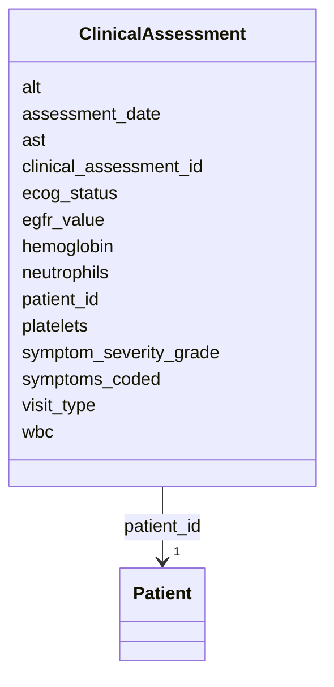

# Class: ClinicalAssessment 


_Longitudinal clinical status (ECOG, symptoms, labs) - multiple rows per patient_


URI: [clinical_model:ClinicalAssessment](https://uk-cpi.com/clinical_model/ClinicalAssessment)





<!-- no inheritance hierarchy -->

## Slots

| Name | Cardinality and Range | Description | Inheritance |
| ---  | --- | --- | --- |
| [clinical_assessment_id](clinical_assessment_id.md) | 1 <br/> [String](String.md) |  | direct |
| [patient_id](patient_id.md) | 1 <br/> [Patient](Patient.md) |  | direct |
| [assessment_date](assessment_date.md) | 1 <br/> [Date](Date.md) |  | direct |
| [visit_type](visit_type.md) | 0..1 <br/> [String](String.md) |  | direct |
| [ecog_status](ecog_status.md) | 0..1 <br/> [Integer](Integer.md) |  | direct |
| [symptoms_coded](symptoms_coded.md) | 0..1 <br/> [String](String.md) |  | direct |
| [symptom_severity_grade](symptom_severity_grade.md) | 0..1 <br/> [Integer](Integer.md) |  | direct |
| [wbc](wbc.md) | 0..1 <br/> [Float](Float.md) |  | direct |
| [hemoglobin](hemoglobin.md) | 0..1 <br/> [Float](Float.md) |  | direct |
| [platelets](platelets.md) | 0..1 <br/> [Float](Float.md) |  | direct |
| [neutrophils](neutrophils.md) | 0..1 <br/> [Float](Float.md) |  | direct |
| [egfr_value](egfr_value.md) | 0..1 <br/> [Float](Float.md) |  | direct |
| [alt](alt.md) | 0..1 <br/> [Float](Float.md) |  | direct |
| [ast](ast.md) | 0..1 <br/> [Float](Float.md) |  | direct |


## Identifier and Mapping Information


### Schema Source


* from schema: https://ngdx.org/clinical_model


## Mappings

| Mapping Type | Mapped Value |
| ---  | ---  |
| self | clinical_model:ClinicalAssessment |
| native | clinical_model:ClinicalAssessment |


## LinkML Source

<!-- TODO: investigate https://stackoverflow.com/questions/37606292/how-to-create-tabbed-code-blocks-in-mkdocs-or-sphinx -->

### Direct

<details>
```yaml
name: ClinicalAssessment
description: Longitudinal clinical status (ECOG, symptoms, labs) - multiple rows per
  patient
from_schema: https://ngdx.org/clinical_model
rank: 1000
slots:
- clinical_assessment_id
- patient_id
- assessment_date
- visit_type
- ecog_status
- symptoms_coded
- symptom_severity_grade
- wbc
- hemoglobin
- platelets
- neutrophils
- egfr_value
- alt
- ast
slot_usage:
  clinical_assessment_id:
    name: clinical_assessment_id
    range: string
  patient_id:
    name: patient_id
    identifier: false
  ecog_status:
    name: ecog_status
    identifier: false

```
</details>

### Induced

<details>
```yaml
name: ClinicalAssessment
description: Longitudinal clinical status (ECOG, symptoms, labs) - multiple rows per
  patient
from_schema: https://ngdx.org/clinical_model
rank: 1000
slot_usage:
  clinical_assessment_id:
    name: clinical_assessment_id
    range: string
  patient_id:
    name: patient_id
    identifier: false
  ecog_status:
    name: ecog_status
    identifier: false
attributes:
  clinical_assessment_id:
    name: clinical_assessment_id
    from_schema: https://ngdx.org/clinical_model
    rank: 1000
    identifier: true
    alias: clinical_assessment_id
    owner: ClinicalAssessment
    domain_of:
    - ClinicalAssessment
    range: string
    required: true
  patient_id:
    name: patient_id
    from_schema: https://ngdx.org/clinical_model
    rank: 1000
    identifier: false
    alias: patient_id
    owner: ClinicalAssessment
    domain_of:
    - Patient
    - Biopsy
    - Treatment
    - ResponseAssessment
    - ClinicalAssessment
    - ImagingStudy
    range: Patient
    required: true
    pattern: ^NGDX-[0-9]{3}$
  assessment_date:
    name: assessment_date
    from_schema: https://ngdx.org/clinical_model
    rank: 1000
    alias: assessment_date
    owner: ClinicalAssessment
    domain_of:
    - ResponseAssessment
    - ClinicalAssessment
    range: date
    required: true
  visit_type:
    name: visit_type
    from_schema: https://ngdx.org/clinical_model
    rank: 1000
    alias: visit_type
    owner: ClinicalAssessment
    domain_of:
    - ClinicalAssessment
    range: string
  ecog_status:
    name: ecog_status
    from_schema: https://ngdx.org/clinical_model
    rank: 1000
    identifier: false
    alias: ecog_status
    owner: ClinicalAssessment
    domain_of:
    - ResponseAssessment
    - ClinicalAssessment
    range: integer
    minimum_value: 0
    maximum_value: 5
  symptoms_coded:
    name: symptoms_coded
    from_schema: https://ngdx.org/clinical_model
    rank: 1000
    alias: symptoms_coded
    owner: ClinicalAssessment
    domain_of:
    - ClinicalAssessment
    range: string
  symptom_severity_grade:
    name: symptom_severity_grade
    from_schema: https://ngdx.org/clinical_model
    rank: 1000
    alias: symptom_severity_grade
    owner: ClinicalAssessment
    domain_of:
    - ClinicalAssessment
    range: integer
    minimum_value: 0
    maximum_value: 5
  wbc:
    name: wbc
    from_schema: https://ngdx.org/clinical_model
    rank: 1000
    alias: wbc
    owner: ClinicalAssessment
    domain_of:
    - ClinicalAssessment
    range: float
    minimum_value: 0
  hemoglobin:
    name: hemoglobin
    from_schema: https://ngdx.org/clinical_model
    rank: 1000
    alias: hemoglobin
    owner: ClinicalAssessment
    domain_of:
    - ClinicalAssessment
    range: float
    minimum_value: 0
  platelets:
    name: platelets
    from_schema: https://ngdx.org/clinical_model
    rank: 1000
    alias: platelets
    owner: ClinicalAssessment
    domain_of:
    - ClinicalAssessment
    range: float
    minimum_value: 0
  neutrophils:
    name: neutrophils
    from_schema: https://ngdx.org/clinical_model
    rank: 1000
    alias: neutrophils
    owner: ClinicalAssessment
    domain_of:
    - ClinicalAssessment
    range: float
    minimum_value: 0
  egfr_value:
    name: egfr_value
    from_schema: https://ngdx.org/clinical_model
    rank: 1000
    alias: egfr_value
    owner: ClinicalAssessment
    domain_of:
    - ClinicalAssessment
    range: float
    minimum_value: 0
    maximum_value: 200
  alt:
    name: alt
    from_schema: https://ngdx.org/clinical_model
    rank: 1000
    alias: alt
    owner: ClinicalAssessment
    domain_of:
    - ClinicalAssessment
    range: float
    minimum_value: 0
  ast:
    name: ast
    from_schema: https://ngdx.org/clinical_model
    rank: 1000
    alias: ast
    owner: ClinicalAssessment
    domain_of:
    - ClinicalAssessment
    range: float
    minimum_value: 0

```
</details>