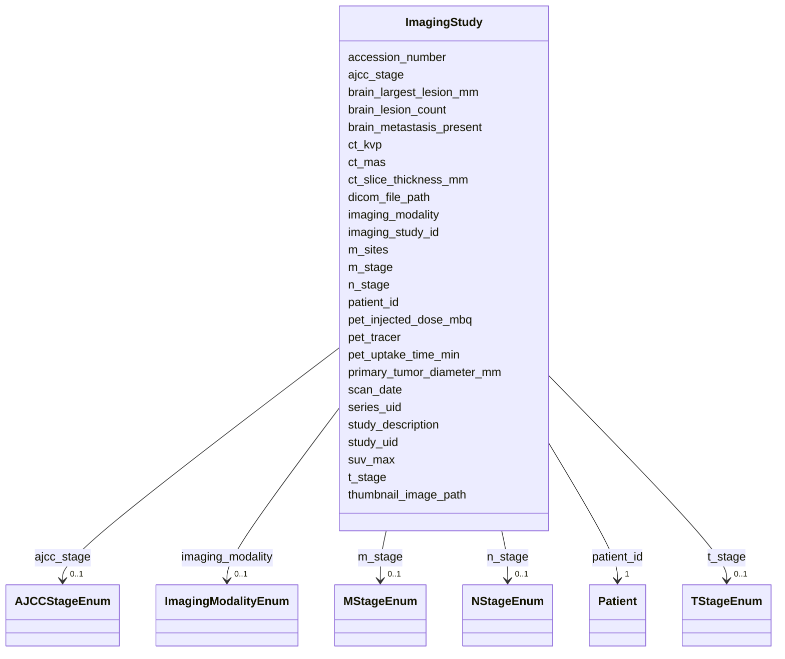

# Class: ImagingStudy 


_Imaging study (CT, PET, MRI) with TNM staging - multiple rows per patient_


URI: [clinical_model:ImagingStudy](https://uk-cpi.com/clinical_model/ImagingStudy)





<!-- no inheritance hierarchy -->

## Slots

| Name | Cardinality and Range | Description | Inheritance |
| ---  | --- | --- | --- |
| [imaging_study_id](imaging_study_id.md) | 1 <br/> [String](String.md) |  | direct |
| [patient_id](patient_id.md) | 1 <br/> [Patient](Patient.md) |  | direct |
| [study_uid](study_uid.md) | 0..1 <br/> [String](String.md) |  | direct |
| [series_uid](series_uid.md) | 0..1 <br/> [String](String.md) |  | direct |
| [accession_number](accession_number.md) | 0..1 <br/> [String](String.md) |  | direct |
| [scan_date](scan_date.md) | 1 <br/> [Date](Date.md) |  | direct |
| [imaging_modality](imaging_modality.md) | 0..1 <br/> [ImagingModalityEnum](ImagingModalityEnum.md) |  | direct |
| [study_description](study_description.md) | 0..1 <br/> [String](String.md) |  | direct |
| [dicom_file_path](dicom_file_path.md) | 0..1 <br/> [String](String.md) |  | direct |
| [thumbnail_image_path](thumbnail_image_path.md) | 0..1 <br/> [String](String.md) |  | direct |
| [ct_kvp](ct_kvp.md) | 0..1 <br/> [Integer](Integer.md) |  | direct |
| [ct_mas](ct_mas.md) | 0..1 <br/> [Float](Float.md) |  | direct |
| [ct_slice_thickness_mm](ct_slice_thickness_mm.md) | 0..1 <br/> [Float](Float.md) |  | direct |
| [pet_tracer](pet_tracer.md) | 0..1 <br/> [String](String.md) |  | direct |
| [pet_injected_dose_mbq](pet_injected_dose_mbq.md) | 0..1 <br/> [Float](Float.md) |  | direct |
| [pet_uptake_time_min](pet_uptake_time_min.md) | 0..1 <br/> [Float](Float.md) |  | direct |
| [t_stage](t_stage.md) | 0..1 <br/> [TStageEnum](TStageEnum.md) |  | direct |
| [n_stage](n_stage.md) | 0..1 <br/> [NStageEnum](NStageEnum.md) |  | direct |
| [m_stage](m_stage.md) | 0..1 <br/> [MStageEnum](MStageEnum.md) |  | direct |
| [m_sites](m_sites.md) | 0..1 <br/> [String](String.md) |  | direct |
| [ajcc_stage](ajcc_stage.md) | 0..1 <br/> [AJCCStageEnum](AJCCStageEnum.md) |  | direct |
| [primary_tumor_diameter_mm](primary_tumor_diameter_mm.md) | 0..1 <br/> [Float](Float.md) |  | direct |
| [suv_max](suv_max.md) | 0..1 <br/> [Float](Float.md) |  | direct |
| [brain_metastasis_present](brain_metastasis_present.md) | 0..1 <br/> [Boolean](Boolean.md) |  | direct |
| [brain_lesion_count](brain_lesion_count.md) | 0..1 <br/> [Integer](Integer.md) |  | direct |
| [brain_largest_lesion_mm](brain_largest_lesion_mm.md) | 0..1 <br/> [Float](Float.md) |  | direct |


## Usages

| used by | used in | type | used |
| ---  | --- | --- | --- |
| [ResponseAssessment](ResponseAssessment.md) | [imaging_study_id](imaging_study_id.md) | range | [ImagingStudy](ImagingStudy.md) |


## Identifier and Mapping Information


### Schema Source


* from schema: https://ngdx.org/clinical_model


## Mappings

| Mapping Type | Mapped Value |
| ---  | ---  |
| self | clinical_model:ImagingStudy |
| native | clinical_model:ImagingStudy |


## LinkML Source

<!-- TODO: investigate https://stackoverflow.com/questions/37606292/how-to-create-tabbed-code-blocks-in-mkdocs-or-sphinx -->

### Direct

<details>
```yaml
name: ImagingStudy
description: Imaging study (CT, PET, MRI) with TNM staging - multiple rows per patient
from_schema: https://ngdx.org/clinical_model
rank: 1000
slots:
- imaging_study_id
- patient_id
- study_uid
- series_uid
- accession_number
- scan_date
- imaging_modality
- study_description
- dicom_file_path
- thumbnail_image_path
- ct_kvp
- ct_mas
- ct_slice_thickness_mm
- pet_tracer
- pet_injected_dose_mbq
- pet_uptake_time_min
- t_stage
- n_stage
- m_stage
- m_sites
- ajcc_stage
- primary_tumor_diameter_mm
- suv_max
- brain_metastasis_present
- brain_lesion_count
- brain_largest_lesion_mm
slot_usage:
  imaging_study_id:
    name: imaging_study_id
    range: string
  patient_id:
    name: patient_id
    identifier: false

```
</details>

### Induced

<details>
```yaml
name: ImagingStudy
description: Imaging study (CT, PET, MRI) with TNM staging - multiple rows per patient
from_schema: https://ngdx.org/clinical_model
rank: 1000
slot_usage:
  imaging_study_id:
    name: imaging_study_id
    range: string
  patient_id:
    name: patient_id
    identifier: false
attributes:
  imaging_study_id:
    name: imaging_study_id
    from_schema: https://ngdx.org/clinical_model
    rank: 1000
    identifier: true
    alias: imaging_study_id
    owner: ImagingStudy
    domain_of:
    - ResponseAssessment
    - ImagingStudy
    range: string
    required: true
  patient_id:
    name: patient_id
    from_schema: https://ngdx.org/clinical_model
    rank: 1000
    identifier: false
    alias: patient_id
    owner: ImagingStudy
    domain_of:
    - Patient
    - Biopsy
    - Treatment
    - ResponseAssessment
    - ClinicalAssessment
    - ImagingStudy
    range: Patient
    required: true
    pattern: ^NGDX-[0-9]{3}$
  study_uid:
    name: study_uid
    from_schema: https://ngdx.org/clinical_model
    rank: 1000
    alias: study_uid
    owner: ImagingStudy
    domain_of:
    - ImagingStudy
    range: string
    pattern: ^[0-9.]{1,64}$
  series_uid:
    name: series_uid
    from_schema: https://ngdx.org/clinical_model
    rank: 1000
    alias: series_uid
    owner: ImagingStudy
    domain_of:
    - ImagingStudy
    range: string
  accession_number:
    name: accession_number
    from_schema: https://ngdx.org/clinical_model
    rank: 1000
    alias: accession_number
    owner: ImagingStudy
    domain_of:
    - ImagingStudy
    range: string
  scan_date:
    name: scan_date
    from_schema: https://ngdx.org/clinical_model
    rank: 1000
    alias: scan_date
    owner: ImagingStudy
    domain_of:
    - ImagingStudy
    range: date
    required: true
  imaging_modality:
    name: imaging_modality
    from_schema: https://ngdx.org/clinical_model
    rank: 1000
    alias: imaging_modality
    owner: ImagingStudy
    domain_of:
    - ImagingStudy
    range: ImagingModalityEnum
  study_description:
    name: study_description
    from_schema: https://ngdx.org/clinical_model
    rank: 1000
    alias: study_description
    owner: ImagingStudy
    domain_of:
    - ImagingStudy
    range: string
  dicom_file_path:
    name: dicom_file_path
    from_schema: https://ngdx.org/clinical_model
    rank: 1000
    alias: dicom_file_path
    owner: ImagingStudy
    domain_of:
    - ImagingStudy
    range: string
  thumbnail_image_path:
    name: thumbnail_image_path
    from_schema: https://ngdx.org/clinical_model
    rank: 1000
    alias: thumbnail_image_path
    owner: ImagingStudy
    domain_of:
    - ImagingStudy
    range: string
  ct_kvp:
    name: ct_kvp
    from_schema: https://ngdx.org/clinical_model
    rank: 1000
    alias: ct_kvp
    owner: ImagingStudy
    domain_of:
    - ImagingStudy
    range: integer
    minimum_value: 0
  ct_mas:
    name: ct_mas
    from_schema: https://ngdx.org/clinical_model
    rank: 1000
    alias: ct_mas
    owner: ImagingStudy
    domain_of:
    - ImagingStudy
    range: float
    minimum_value: 0
  ct_slice_thickness_mm:
    name: ct_slice_thickness_mm
    from_schema: https://ngdx.org/clinical_model
    rank: 1000
    alias: ct_slice_thickness_mm
    owner: ImagingStudy
    domain_of:
    - ImagingStudy
    range: float
    minimum_value: 0
  pet_tracer:
    name: pet_tracer
    from_schema: https://ngdx.org/clinical_model
    rank: 1000
    alias: pet_tracer
    owner: ImagingStudy
    domain_of:
    - ImagingStudy
    range: string
  pet_injected_dose_mbq:
    name: pet_injected_dose_mbq
    from_schema: https://ngdx.org/clinical_model
    rank: 1000
    alias: pet_injected_dose_mbq
    owner: ImagingStudy
    domain_of:
    - ImagingStudy
    range: float
    minimum_value: 0
  pet_uptake_time_min:
    name: pet_uptake_time_min
    from_schema: https://ngdx.org/clinical_model
    rank: 1000
    alias: pet_uptake_time_min
    owner: ImagingStudy
    domain_of:
    - ImagingStudy
    range: float
    minimum_value: 0
  t_stage:
    name: t_stage
    from_schema: https://ngdx.org/clinical_model
    rank: 1000
    alias: t_stage
    owner: ImagingStudy
    domain_of:
    - ImagingStudy
    range: TStageEnum
  n_stage:
    name: n_stage
    from_schema: https://ngdx.org/clinical_model
    rank: 1000
    alias: n_stage
    owner: ImagingStudy
    domain_of:
    - ImagingStudy
    range: NStageEnum
  m_stage:
    name: m_stage
    from_schema: https://ngdx.org/clinical_model
    rank: 1000
    alias: m_stage
    owner: ImagingStudy
    domain_of:
    - ImagingStudy
    range: MStageEnum
  m_sites:
    name: m_sites
    from_schema: https://ngdx.org/clinical_model
    rank: 1000
    alias: m_sites
    owner: ImagingStudy
    domain_of:
    - ImagingStudy
    range: string
  ajcc_stage:
    name: ajcc_stage
    from_schema: https://ngdx.org/clinical_model
    rank: 1000
    alias: ajcc_stage
    owner: ImagingStudy
    domain_of:
    - ImagingStudy
    range: AJCCStageEnum
  primary_tumor_diameter_mm:
    name: primary_tumor_diameter_mm
    from_schema: https://ngdx.org/clinical_model
    rank: 1000
    alias: primary_tumor_diameter_mm
    owner: ImagingStudy
    domain_of:
    - ImagingStudy
    range: float
    minimum_value: 0
    maximum_value: 300
  suv_max:
    name: suv_max
    from_schema: https://ngdx.org/clinical_model
    rank: 1000
    alias: suv_max
    owner: ImagingStudy
    domain_of:
    - ImagingStudy
    range: float
    minimum_value: 0
    maximum_value: 50
  brain_metastasis_present:
    name: brain_metastasis_present
    from_schema: https://ngdx.org/clinical_model
    rank: 1000
    alias: brain_metastasis_present
    owner: ImagingStudy
    domain_of:
    - ImagingStudy
    range: boolean
  brain_lesion_count:
    name: brain_lesion_count
    from_schema: https://ngdx.org/clinical_model
    rank: 1000
    alias: brain_lesion_count
    owner: ImagingStudy
    domain_of:
    - ImagingStudy
    range: integer
    minimum_value: 0
  brain_largest_lesion_mm:
    name: brain_largest_lesion_mm
    from_schema: https://ngdx.org/clinical_model
    rank: 1000
    alias: brain_largest_lesion_mm
    owner: ImagingStudy
    domain_of:
    - ImagingStudy
    range: float
    minimum_value: 0

```
</details>