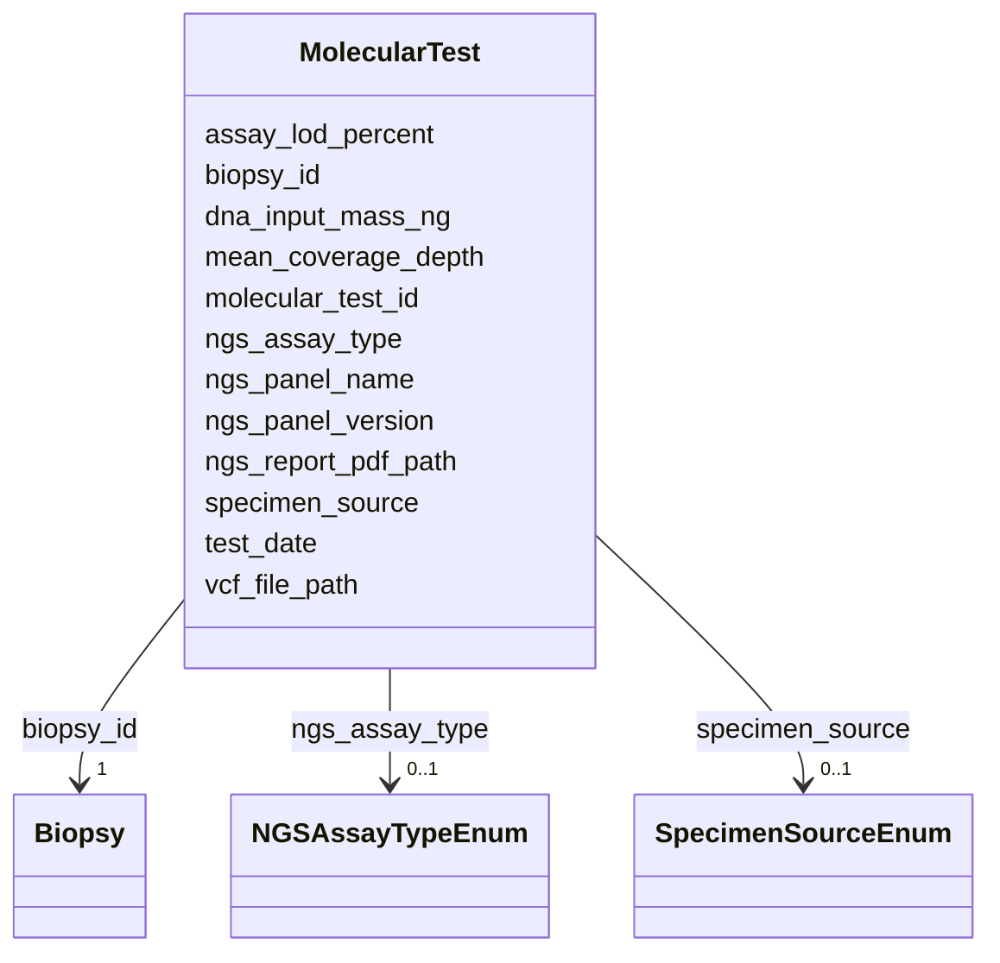

# Class: MolecularTest 


_NGS test from tissue or ctDNA - multiple rows per patient_


URI: [clinical_model:MolecularTest](https://uk-cpi.com/clinical_model/MolecularTest)





<!-- no inheritance hierarchy -->

## Slots

| Name | Cardinality and Range | Description | Inheritance |
| ---  | --- | --- | --- |
| [molecular_test_id](molecular_test_id.md) | 1 <br/> [String](String.md) |  | direct |
| [biopsy_id](biopsy_id.md) | 1 <br/> [Biopsy](Biopsy.md) |  | direct |
| [test_date](test_date.md) | 1 <br/> [Date](Date.md) |  | direct |
| [specimen_source](specimen_source.md) | 0..1 <br/> [SpecimenSourceEnum](SpecimenSourceEnum.md) |  | direct |
| [ngs_panel_name](ngs_panel_name.md) | 0..1 <br/> [String](String.md) |  | direct |
| [ngs_panel_version](ngs_panel_version.md) | 0..1 <br/> [String](String.md) |  | direct |
| [ngs_assay_type](ngs_assay_type.md) | 0..1 <br/> [NGSAssayTypeEnum](NGSAssayTypeEnum.md) |  | direct |
| [dna_input_mass_ng](dna_input_mass_ng.md) | 0..1 <br/> [Float](Float.md) |  | direct |
| [mean_coverage_depth](mean_coverage_depth.md) | 0..1 <br/> [Float](Float.md) |  | direct |
| [assay_lod_percent](assay_lod_percent.md) | 0..1 <br/> [Float](Float.md) |  | direct |
| [ngs_report_pdf_path](ngs_report_pdf_path.md) | 0..1 <br/> [String](String.md) |  | direct |
| [vcf_file_path](vcf_file_path.md) | 0..1 <br/> [String](String.md) |  | direct |


## Usages

| used by | used in | type | used |
| ---  | --- | --- | --- |
| [Mutation](Mutation.md) | [molecular_test_id](molecular_test_id.md) | range | [MolecularTest](MolecularTest.md) |
| [ResponseAssessment](ResponseAssessment.md) | [molecular_test_id](molecular_test_id.md) | range | [MolecularTest](MolecularTest.md) |


## Identifier and Mapping Information


### Schema Source


* from schema: https://ngdx.org/clinical_model


## Mappings

| Mapping Type | Mapped Value |
| ---  | ---  |
| self | clinical_model:MolecularTest |
| native | clinical_model:MolecularTest |


## LinkML Source

<!-- TODO: investigate https://stackoverflow.com/questions/37606292/how-to-create-tabbed-code-blocks-in-mkdocs-or-sphinx -->

### Direct

<details>
```yaml
name: MolecularTest
description: NGS test from tissue or ctDNA - multiple rows per patient
from_schema: https://ngdx.org/clinical_model
rank: 1000
slots:
- molecular_test_id
- biopsy_id
- test_date
- specimen_source
- ngs_panel_name
- ngs_panel_version
- ngs_assay_type
- dna_input_mass_ng
- mean_coverage_depth
- assay_lod_percent
- ngs_report_pdf_path
- vcf_file_path
slot_usage:
  molecular_test_id:
    name: molecular_test_id
    range: string
  biopsy_id:
    name: biopsy_id
    identifier: false

```
</details>

### Induced

<details>
```yaml
name: MolecularTest
description: NGS test from tissue or ctDNA - multiple rows per patient
from_schema: https://ngdx.org/clinical_model
rank: 1000
slot_usage:
  molecular_test_id:
    name: molecular_test_id
    range: string
  biopsy_id:
    name: biopsy_id
    identifier: false
attributes:
  molecular_test_id:
    name: molecular_test_id
    from_schema: https://ngdx.org/clinical_model
    rank: 1000
    identifier: true
    alias: molecular_test_id
    owner: MolecularTest
    domain_of:
    - MolecularTest
    - Mutation
    - ResponseAssessment
    range: string
    required: true
  biopsy_id:
    name: biopsy_id
    from_schema: https://ngdx.org/clinical_model
    rank: 1000
    identifier: false
    alias: biopsy_id
    owner: MolecularTest
    domain_of:
    - Biopsy
    - MolecularTest
    range: Biopsy
    required: true
  test_date:
    name: test_date
    from_schema: https://ngdx.org/clinical_model
    rank: 1000
    alias: test_date
    owner: MolecularTest
    domain_of:
    - MolecularTest
    range: date
    required: true
  specimen_source:
    name: specimen_source
    from_schema: https://ngdx.org/clinical_model
    rank: 1000
    alias: specimen_source
    owner: MolecularTest
    domain_of:
    - MolecularTest
    range: SpecimenSourceEnum
  ngs_panel_name:
    name: ngs_panel_name
    from_schema: https://ngdx.org/clinical_model
    rank: 1000
    alias: ngs_panel_name
    owner: MolecularTest
    domain_of:
    - MolecularTest
    range: string
  ngs_panel_version:
    name: ngs_panel_version
    from_schema: https://ngdx.org/clinical_model
    rank: 1000
    alias: ngs_panel_version
    owner: MolecularTest
    domain_of:
    - MolecularTest
    range: string
  ngs_assay_type:
    name: ngs_assay_type
    from_schema: https://ngdx.org/clinical_model
    rank: 1000
    alias: ngs_assay_type
    owner: MolecularTest
    domain_of:
    - MolecularTest
    range: NGSAssayTypeEnum
  dna_input_mass_ng:
    name: dna_input_mass_ng
    from_schema: https://ngdx.org/clinical_model
    rank: 1000
    alias: dna_input_mass_ng
    owner: MolecularTest
    domain_of:
    - MolecularTest
    range: float
    minimum_value: 0
  mean_coverage_depth:
    name: mean_coverage_depth
    from_schema: https://ngdx.org/clinical_model
    rank: 1000
    alias: mean_coverage_depth
    owner: MolecularTest
    domain_of:
    - MolecularTest
    range: float
    minimum_value: 0
  assay_lod_percent:
    name: assay_lod_percent
    from_schema: https://ngdx.org/clinical_model
    rank: 1000
    alias: assay_lod_percent
    owner: MolecularTest
    domain_of:
    - MolecularTest
    range: float
    minimum_value: 0
    maximum_value: 100
  ngs_report_pdf_path:
    name: ngs_report_pdf_path
    from_schema: https://ngdx.org/clinical_model
    rank: 1000
    alias: ngs_report_pdf_path
    owner: MolecularTest
    domain_of:
    - MolecularTest
    range: string
  vcf_file_path:
    name: vcf_file_path
    from_schema: https://ngdx.org/clinical_model
    rank: 1000
    alias: vcf_file_path
    owner: MolecularTest
    domain_of:
    - MolecularTest
    range: string

```
</details>