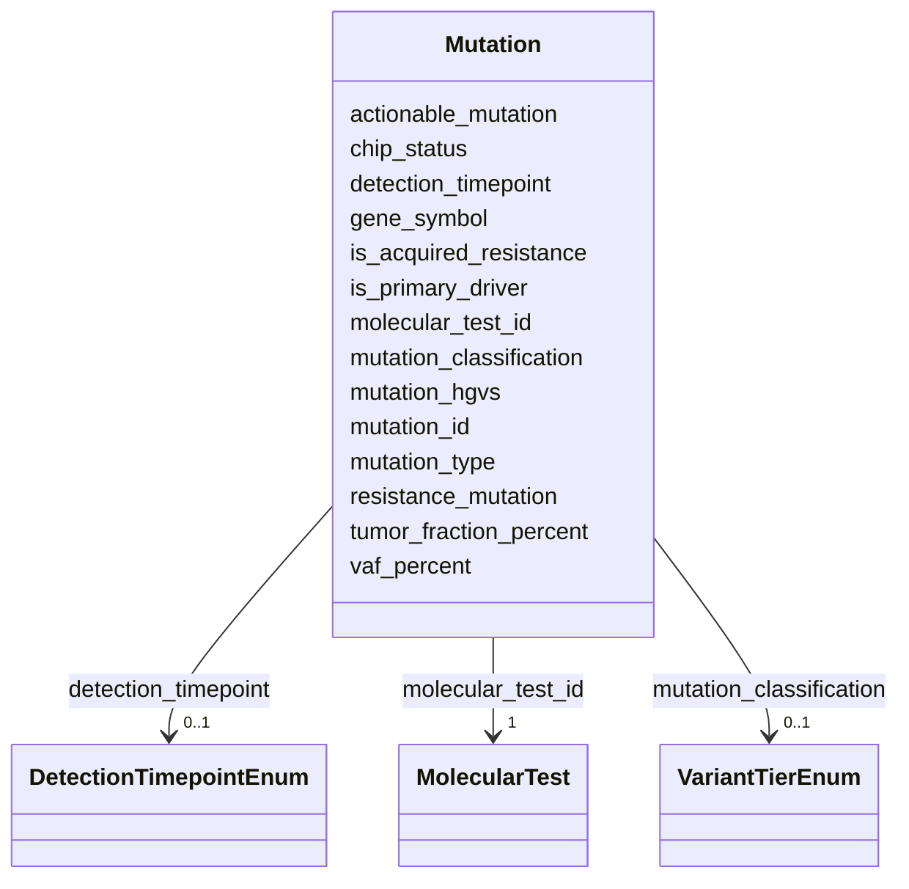

# Class: Mutation 


_Individual genomic variant detected in NGS test - normalized to enable time-series tracking_


URI: [clinical_model:Mutation](https://uk-cpi.com/clinical_model/Mutation)





<!-- no inheritance hierarchy -->

## Slots

| Name | Cardinality and Range | Description | Inheritance |
| ---  | --- | --- | --- |
| [mutation_id](mutation_id.md) | 1 <br/> [String](String.md) |  | direct |
| [molecular_test_id](molecular_test_id.md) | 1 <br/> [MolecularTest](MolecularTest.md) |  | direct |
| [gene_symbol](gene_symbol.md) | 1 <br/> [String](String.md) |  | direct |
| [mutation_hgvs](mutation_hgvs.md) | 0..1 <br/> [String](String.md) |  | direct |
| [mutation_type](mutation_type.md) | 0..1 <br/> [String](String.md) |  | direct |
| [mutation_classification](mutation_classification.md) | 0..1 <br/> [VariantTierEnum](VariantTierEnum.md) |  | direct |
| [vaf_percent](vaf_percent.md) | 0..1 <br/> [Float](Float.md) |  | direct |
| [tumor_fraction_percent](tumor_fraction_percent.md) | 0..1 <br/> [Float](Float.md) |  | direct |
| [actionable_mutation](actionable_mutation.md) | 0..1 <br/> [Boolean](Boolean.md) |  | direct |
| [resistance_mutation](resistance_mutation.md) | 0..1 <br/> [Boolean](Boolean.md) |  | direct |
| [chip_status](chip_status.md) | 0..1 <br/> [String](String.md) |  | direct |
| [is_primary_driver](is_primary_driver.md) | 0..1 <br/> [Boolean](Boolean.md) |  | direct |
| [is_acquired_resistance](is_acquired_resistance.md) | 0..1 <br/> [Boolean](Boolean.md) |  | direct |
| [detection_timepoint](detection_timepoint.md) | 0..1 <br/> [DetectionTimepointEnum](DetectionTimepointEnum.md) |  | direct |


## Identifier and Mapping Information


### Schema Source


* from schema: https://ngdx.org/clinical_model


## Mappings

| Mapping Type | Mapped Value |
| ---  | ---  |
| self | clinical_model:Mutation |
| native | clinical_model:Mutation |


## LinkML Source

<!-- TODO: investigate https://stackoverflow.com/questions/37606292/how-to-create-tabbed-code-blocks-in-mkdocs-or-sphinx -->

### Direct

<details>
```yaml
name: Mutation
description: Individual genomic variant detected in NGS test - normalized to enable
  time-series tracking
from_schema: https://ngdx.org/clinical_model
rank: 1000
slots:
- mutation_id
- molecular_test_id
- gene_symbol
- mutation_hgvs
- mutation_type
- mutation_classification
- vaf_percent
- tumor_fraction_percent
- actionable_mutation
- resistance_mutation
- chip_status
- is_primary_driver
- is_acquired_resistance
- detection_timepoint
slot_usage:
  mutation_id:
    name: mutation_id
    range: string
  molecular_test_id:
    name: molecular_test_id
    identifier: false
    required: true

```
</details>

### Induced

<details>
```yaml
name: Mutation
description: Individual genomic variant detected in NGS test - normalized to enable
  time-series tracking
from_schema: https://ngdx.org/clinical_model
rank: 1000
slot_usage:
  mutation_id:
    name: mutation_id
    range: string
  molecular_test_id:
    name: molecular_test_id
    identifier: false
    required: true
attributes:
  mutation_id:
    name: mutation_id
    from_schema: https://ngdx.org/clinical_model
    rank: 1000
    identifier: true
    alias: mutation_id
    owner: Mutation
    domain_of:
    - Mutation
    range: string
    required: true
  molecular_test_id:
    name: molecular_test_id
    from_schema: https://ngdx.org/clinical_model
    rank: 1000
    identifier: false
    alias: molecular_test_id
    owner: Mutation
    domain_of:
    - MolecularTest
    - Mutation
    - ResponseAssessment
    range: MolecularTest
    required: true
  gene_symbol:
    name: gene_symbol
    from_schema: https://ngdx.org/clinical_model
    rank: 1000
    alias: gene_symbol
    owner: Mutation
    domain_of:
    - Mutation
    range: string
    required: true
    pattern: ^[A-Z0-9-]+$
  mutation_hgvs:
    name: mutation_hgvs
    from_schema: https://ngdx.org/clinical_model
    rank: 1000
    alias: mutation_hgvs
    owner: Mutation
    domain_of:
    - Mutation
    range: string
    pattern: ^[cp]\..+$
  mutation_type:
    name: mutation_type
    from_schema: https://ngdx.org/clinical_model
    rank: 1000
    alias: mutation_type
    owner: Mutation
    domain_of:
    - Mutation
    range: string
  mutation_classification:
    name: mutation_classification
    from_schema: https://ngdx.org/clinical_model
    rank: 1000
    alias: mutation_classification
    owner: Mutation
    domain_of:
    - Mutation
    range: VariantTierEnum
  vaf_percent:
    name: vaf_percent
    from_schema: https://ngdx.org/clinical_model
    rank: 1000
    alias: vaf_percent
    owner: Mutation
    domain_of:
    - Mutation
    range: float
    minimum_value: 0.0
    maximum_value: 100.0
  tumor_fraction_percent:
    name: tumor_fraction_percent
    from_schema: https://ngdx.org/clinical_model
    rank: 1000
    alias: tumor_fraction_percent
    owner: Mutation
    domain_of:
    - Mutation
    range: float
    minimum_value: 0.0
    maximum_value: 100.0
  actionable_mutation:
    name: actionable_mutation
    from_schema: https://ngdx.org/clinical_model
    rank: 1000
    alias: actionable_mutation
    owner: Mutation
    domain_of:
    - Mutation
    range: boolean
  resistance_mutation:
    name: resistance_mutation
    from_schema: https://ngdx.org/clinical_model
    rank: 1000
    alias: resistance_mutation
    owner: Mutation
    domain_of:
    - Mutation
    range: boolean
  chip_status:
    name: chip_status
    from_schema: https://ngdx.org/clinical_model
    rank: 1000
    alias: chip_status
    owner: Mutation
    domain_of:
    - Mutation
    range: string
  is_primary_driver:
    name: is_primary_driver
    from_schema: https://ngdx.org/clinical_model
    rank: 1000
    alias: is_primary_driver
    owner: Mutation
    domain_of:
    - Mutation
    range: boolean
  is_acquired_resistance:
    name: is_acquired_resistance
    from_schema: https://ngdx.org/clinical_model
    rank: 1000
    alias: is_acquired_resistance
    owner: Mutation
    domain_of:
    - Mutation
    range: boolean
  detection_timepoint:
    name: detection_timepoint
    from_schema: https://ngdx.org/clinical_model
    rank: 1000
    alias: detection_timepoint
    owner: Mutation
    domain_of:
    - Mutation
    range: DetectionTimepointEnum

```
</details>