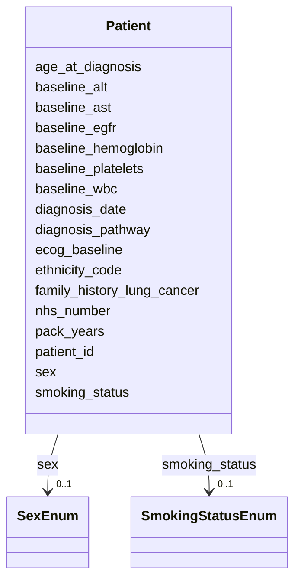

# Class: Patient 


_Core patient entity with demographics and baseline clinical data_


URI: [clinical_model:Patient](https://uk-cpi.com/clinical_model/Patient)





<!-- no inheritance hierarchy -->

## Slots

| Name | Cardinality and Range | Description | Inheritance |
| ---  | --- | --- | --- |
| [patient_id](patient_id.md) | 1 <br/> [String](String.md) |  | direct |
| [nhs_number](nhs_number.md) | 1 <br/> [String](String.md) |  | direct |
| [age_at_diagnosis](age_at_diagnosis.md) | 0..1 <br/> [Integer](Integer.md) |  | direct |
| [sex](sex.md) | 0..1 <br/> [SexEnum](SexEnum.md) |  | direct |
| [ethnicity_code](ethnicity_code.md) | 0..1 <br/> [String](String.md) |  | direct |
| [smoking_status](smoking_status.md) | 0..1 <br/> [SmokingStatusEnum](SmokingStatusEnum.md) |  | direct |
| [pack_years](pack_years.md) | 0..1 <br/> [Float](Float.md) |  | direct |
| [family_history_lung_cancer](family_history_lung_cancer.md) | 0..1 <br/> [Boolean](Boolean.md) |  | direct |
| [ecog_baseline](ecog_baseline.md) | 0..1 <br/> [Integer](Integer.md) |  | direct |
| [baseline_egfr](baseline_egfr.md) | 0..1 <br/> [Float](Float.md) |  | direct |
| [baseline_wbc](baseline_wbc.md) | 0..1 <br/> [Float](Float.md) |  | direct |
| [baseline_hemoglobin](baseline_hemoglobin.md) | 0..1 <br/> [Float](Float.md) |  | direct |
| [baseline_platelets](baseline_platelets.md) | 0..1 <br/> [Float](Float.md) |  | direct |
| [baseline_alt](baseline_alt.md) | 0..1 <br/> [Float](Float.md) |  | direct |
| [baseline_ast](baseline_ast.md) | 0..1 <br/> [Float](Float.md) |  | direct |
| [diagnosis_date](diagnosis_date.md) | 1 <br/> [Date](Date.md) |  | direct |
| [diagnosis_pathway](diagnosis_pathway.md) | 0..1 <br/> [String](String.md) |  | direct |


## Usages

| used by | used in | type | used |
| ---  | --- | --- | --- |
| [Biopsy](Biopsy.md) | [patient_id](patient_id.md) | range | [Patient](Patient.md) |
| [Treatment](Treatment.md) | [patient_id](patient_id.md) | range | [Patient](Patient.md) |
| [ResponseAssessment](ResponseAssessment.md) | [patient_id](patient_id.md) | range | [Patient](Patient.md) |
| [ClinicalAssessment](ClinicalAssessment.md) | [patient_id](patient_id.md) | range | [Patient](Patient.md) |
| [ImagingStudy](ImagingStudy.md) | [patient_id](patient_id.md) | range | [Patient](Patient.md) |


## Identifier and Mapping Information


### Schema Source


* from schema: https://ngdx.org/clinical_model


## Mappings

| Mapping Type | Mapped Value |
| ---  | ---  |
| self | clinical_model:Patient |
| native | clinical_model:Patient |


## LinkML Source

<!-- TODO: investigate https://stackoverflow.com/questions/37606292/how-to-create-tabbed-code-blocks-in-mkdocs-or-sphinx -->

### Direct

<details>
```yaml
name: Patient
description: Core patient entity with demographics and baseline clinical data
from_schema: https://ngdx.org/clinical_model
rank: 1000
slots:
- patient_id
- nhs_number
- age_at_diagnosis
- sex
- ethnicity_code
- smoking_status
- pack_years
- family_history_lung_cancer
- ecog_baseline
- baseline_egfr
- baseline_wbc
- baseline_hemoglobin
- baseline_platelets
- baseline_alt
- baseline_ast
- diagnosis_date
- diagnosis_pathway
slot_usage:
  patient_id:
    name: patient_id
    range: string

```
</details>

### Induced

<details>
```yaml
name: Patient
description: Core patient entity with demographics and baseline clinical data
from_schema: https://ngdx.org/clinical_model
rank: 1000
slot_usage:
  patient_id:
    name: patient_id
    range: string
attributes:
  patient_id:
    name: patient_id
    from_schema: https://ngdx.org/clinical_model
    rank: 1000
    identifier: true
    alias: patient_id
    owner: Patient
    domain_of:
    - Patient
    - Biopsy
    - Treatment
    - ResponseAssessment
    - ClinicalAssessment
    - ImagingStudy
    range: string
    required: true
    pattern: ^NGDX-[0-9]{3}$
  nhs_number:
    name: nhs_number
    from_schema: https://ngdx.org/clinical_model
    rank: 1000
    alias: nhs_number
    owner: Patient
    domain_of:
    - Patient
    range: string
    required: true
    pattern: ^[0-9]{10}$
  age_at_diagnosis:
    name: age_at_diagnosis
    from_schema: https://ngdx.org/clinical_model
    rank: 1000
    alias: age_at_diagnosis
    owner: Patient
    domain_of:
    - Patient
    range: integer
    minimum_value: 0
    maximum_value: 130
  sex:
    name: sex
    from_schema: https://ngdx.org/clinical_model
    rank: 1000
    alias: sex
    owner: Patient
    domain_of:
    - Patient
    range: SexEnum
  ethnicity_code:
    name: ethnicity_code
    from_schema: https://ngdx.org/clinical_model
    rank: 1000
    alias: ethnicity_code
    owner: Patient
    domain_of:
    - Patient
    range: string
  smoking_status:
    name: smoking_status
    from_schema: https://ngdx.org/clinical_model
    rank: 1000
    alias: smoking_status
    owner: Patient
    domain_of:
    - Patient
    range: SmokingStatusEnum
  pack_years:
    name: pack_years
    from_schema: https://ngdx.org/clinical_model
    rank: 1000
    alias: pack_years
    owner: Patient
    domain_of:
    - Patient
    range: float
    minimum_value: 0
    maximum_value: 200
  family_history_lung_cancer:
    name: family_history_lung_cancer
    from_schema: https://ngdx.org/clinical_model
    rank: 1000
    alias: family_history_lung_cancer
    owner: Patient
    domain_of:
    - Patient
    range: boolean
  ecog_baseline:
    name: ecog_baseline
    from_schema: https://ngdx.org/clinical_model
    rank: 1000
    alias: ecog_baseline
    owner: Patient
    domain_of:
    - Patient
    range: integer
    minimum_value: 0
    maximum_value: 5
  baseline_egfr:
    name: baseline_egfr
    from_schema: https://ngdx.org/clinical_model
    rank: 1000
    alias: baseline_egfr
    owner: Patient
    domain_of:
    - Patient
    range: float
    minimum_value: 0
    maximum_value: 200
  baseline_wbc:
    name: baseline_wbc
    from_schema: https://ngdx.org/clinical_model
    rank: 1000
    alias: baseline_wbc
    owner: Patient
    domain_of:
    - Patient
    range: float
    minimum_value: 0
  baseline_hemoglobin:
    name: baseline_hemoglobin
    from_schema: https://ngdx.org/clinical_model
    rank: 1000
    alias: baseline_hemoglobin
    owner: Patient
    domain_of:
    - Patient
    range: float
    minimum_value: 0
  baseline_platelets:
    name: baseline_platelets
    from_schema: https://ngdx.org/clinical_model
    rank: 1000
    alias: baseline_platelets
    owner: Patient
    domain_of:
    - Patient
    range: float
    minimum_value: 0
  baseline_alt:
    name: baseline_alt
    from_schema: https://ngdx.org/clinical_model
    rank: 1000
    alias: baseline_alt
    owner: Patient
    domain_of:
    - Patient
    range: float
    minimum_value: 0
  baseline_ast:
    name: baseline_ast
    from_schema: https://ngdx.org/clinical_model
    rank: 1000
    alias: baseline_ast
    owner: Patient
    domain_of:
    - Patient
    range: float
    minimum_value: 0
  diagnosis_date:
    name: diagnosis_date
    from_schema: https://ngdx.org/clinical_model
    rank: 1000
    alias: diagnosis_date
    owner: Patient
    domain_of:
    - Patient
    range: date
    required: true
  diagnosis_pathway:
    name: diagnosis_pathway
    from_schema: https://ngdx.org/clinical_model
    rank: 1000
    alias: diagnosis_pathway
    owner: Patient
    domain_of:
    - Patient
    range: string

```
</details>