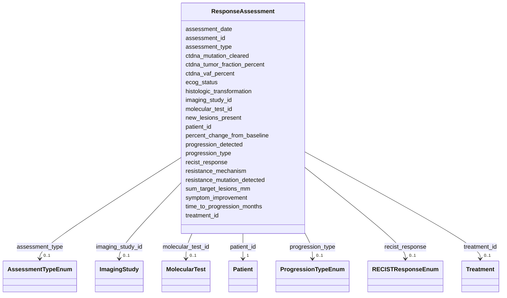

# Class: ResponseAssessment 


_Serial treatment response monitoring (RECIST + ctDNA) - multiple rows per patient_


URI: [clinical_model:ResponseAssessment](https://uk-cpi.com/clinical_model/ResponseAssessment)





<!-- no inheritance hierarchy -->

## Slots

| Name | Cardinality and Range | Description | Inheritance |
| ---  | --- | --- | --- |
| [assessment_id](assessment_id.md) | 1 <br/> [String](String.md) |  | direct |
| [patient_id](patient_id.md) | 1 <br/> [Patient](Patient.md) |  | direct |
| [treatment_id](treatment_id.md) | 0..1 <br/> [Treatment](Treatment.md) |  | direct |
| [imaging_study_id](imaging_study_id.md) | 0..1 <br/> [ImagingStudy](ImagingStudy.md) |  | direct |
| [molecular_test_id](molecular_test_id.md) | 0..1 <br/> [MolecularTest](MolecularTest.md) |  | direct |
| [assessment_date](assessment_date.md) | 1 <br/> [Date](Date.md) |  | direct |
| [assessment_type](assessment_type.md) | 0..1 <br/> [AssessmentTypeEnum](AssessmentTypeEnum.md) |  | direct |
| [recist_response](recist_response.md) | 0..1 <br/> [RECISTResponseEnum](RECISTResponseEnum.md) |  | direct |
| [sum_target_lesions_mm](sum_target_lesions_mm.md) | 0..1 <br/> [Float](Float.md) |  | direct |
| [percent_change_from_baseline](percent_change_from_baseline.md) | 0..1 <br/> [Float](Float.md) |  | direct |
| [new_lesions_present](new_lesions_present.md) | 0..1 <br/> [Boolean](Boolean.md) |  | direct |
| [ctdna_vaf_percent](ctdna_vaf_percent.md) | 0..1 <br/> [Float](Float.md) |  | direct |
| [ctdna_mutation_cleared](ctdna_mutation_cleared.md) | 0..1 <br/> [Boolean](Boolean.md) |  | direct |
| [ctdna_tumor_fraction_percent](ctdna_tumor_fraction_percent.md) | 0..1 <br/> [Float](Float.md) |  | direct |
| [ecog_status](ecog_status.md) | 0..1 <br/> [Integer](Integer.md) |  | direct |
| [symptom_improvement](symptom_improvement.md) | 0..1 <br/> [Boolean](Boolean.md) |  | direct |
| [progression_detected](progression_detected.md) | 0..1 <br/> [Boolean](Boolean.md) |  | direct |
| [progression_type](progression_type.md) | 0..1 <br/> [ProgressionTypeEnum](ProgressionTypeEnum.md) |  | direct |
| [time_to_progression_months](time_to_progression_months.md) | 0..1 <br/> [Float](Float.md) |  | direct |
| [resistance_mutation_detected](resistance_mutation_detected.md) | 0..1 <br/> [Boolean](Boolean.md) |  | direct |
| [resistance_mechanism](resistance_mechanism.md) | 0..1 <br/> [String](String.md) |  | direct |
| [histologic_transformation](histologic_transformation.md) | 0..1 <br/> [Boolean](Boolean.md) |  | direct |


## Identifier and Mapping Information


### Schema Source


* from schema: https://ngdx.org/clinical_model


## Mappings

| Mapping Type | Mapped Value |
| ---  | ---  |
| self | clinical_model:ResponseAssessment |
| native | clinical_model:ResponseAssessment |


## LinkML Source

<!-- TODO: investigate https://stackoverflow.com/questions/37606292/how-to-create-tabbed-code-blocks-in-mkdocs-or-sphinx -->

### Direct

<details>
```yaml
name: ResponseAssessment
description: Serial treatment response monitoring (RECIST + ctDNA) - multiple rows
  per patient
from_schema: https://ngdx.org/clinical_model
rank: 1000
slots:
- assessment_id
- patient_id
- treatment_id
- imaging_study_id
- molecular_test_id
- assessment_date
- assessment_type
- recist_response
- sum_target_lesions_mm
- percent_change_from_baseline
- new_lesions_present
- ctdna_vaf_percent
- ctdna_mutation_cleared
- ctdna_tumor_fraction_percent
- ecog_status
- symptom_improvement
- progression_detected
- progression_type
- time_to_progression_months
- resistance_mutation_detected
- resistance_mechanism
- histologic_transformation
slot_usage:
  assessment_id:
    name: assessment_id
    range: string
  patient_id:
    name: patient_id
    identifier: false
  treatment_id:
    name: treatment_id
    identifier: false
    required: false
  imaging_study_id:
    name: imaging_study_id
    identifier: false
    required: false
  molecular_test_id:
    name: molecular_test_id
    identifier: false
    required: false

```
</details>

### Induced

<details>
```yaml
name: ResponseAssessment
description: Serial treatment response monitoring (RECIST + ctDNA) - multiple rows
  per patient
from_schema: https://ngdx.org/clinical_model
rank: 1000
slot_usage:
  assessment_id:
    name: assessment_id
    range: string
  patient_id:
    name: patient_id
    identifier: false
  treatment_id:
    name: treatment_id
    identifier: false
    required: false
  imaging_study_id:
    name: imaging_study_id
    identifier: false
    required: false
  molecular_test_id:
    name: molecular_test_id
    identifier: false
    required: false
attributes:
  assessment_id:
    name: assessment_id
    from_schema: https://ngdx.org/clinical_model
    rank: 1000
    identifier: true
    alias: assessment_id
    owner: ResponseAssessment
    domain_of:
    - ResponseAssessment
    range: string
    required: true
  patient_id:
    name: patient_id
    from_schema: https://ngdx.org/clinical_model
    rank: 1000
    identifier: false
    alias: patient_id
    owner: ResponseAssessment
    domain_of:
    - Patient
    - Biopsy
    - Treatment
    - ResponseAssessment
    - ClinicalAssessment
    - ImagingStudy
    range: Patient
    required: true
    pattern: ^NGDX-[0-9]{3}$
  treatment_id:
    name: treatment_id
    from_schema: https://ngdx.org/clinical_model
    rank: 1000
    identifier: false
    alias: treatment_id
    owner: ResponseAssessment
    domain_of:
    - Treatment
    - ResponseAssessment
    range: Treatment
    required: false
  imaging_study_id:
    name: imaging_study_id
    from_schema: https://ngdx.org/clinical_model
    rank: 1000
    identifier: false
    alias: imaging_study_id
    owner: ResponseAssessment
    domain_of:
    - ResponseAssessment
    - ImagingStudy
    range: ImagingStudy
    required: false
  molecular_test_id:
    name: molecular_test_id
    from_schema: https://ngdx.org/clinical_model
    rank: 1000
    identifier: false
    alias: molecular_test_id
    owner: ResponseAssessment
    domain_of:
    - MolecularTest
    - Mutation
    - ResponseAssessment
    range: MolecularTest
    required: false
  assessment_date:
    name: assessment_date
    from_schema: https://ngdx.org/clinical_model
    rank: 1000
    alias: assessment_date
    owner: ResponseAssessment
    domain_of:
    - ResponseAssessment
    - ClinicalAssessment
    range: date
    required: true
  assessment_type:
    name: assessment_type
    from_schema: https://ngdx.org/clinical_model
    rank: 1000
    alias: assessment_type
    owner: ResponseAssessment
    domain_of:
    - ResponseAssessment
    range: AssessmentTypeEnum
  recist_response:
    name: recist_response
    from_schema: https://ngdx.org/clinical_model
    rank: 1000
    alias: recist_response
    owner: ResponseAssessment
    domain_of:
    - ResponseAssessment
    range: RECISTResponseEnum
  sum_target_lesions_mm:
    name: sum_target_lesions_mm
    from_schema: https://ngdx.org/clinical_model
    rank: 1000
    alias: sum_target_lesions_mm
    owner: ResponseAssessment
    domain_of:
    - ResponseAssessment
    range: float
    minimum_value: 0
    maximum_value: 500
  percent_change_from_baseline:
    name: percent_change_from_baseline
    from_schema: https://ngdx.org/clinical_model
    rank: 1000
    alias: percent_change_from_baseline
    owner: ResponseAssessment
    domain_of:
    - ResponseAssessment
    range: float
  new_lesions_present:
    name: new_lesions_present
    from_schema: https://ngdx.org/clinical_model
    rank: 1000
    alias: new_lesions_present
    owner: ResponseAssessment
    domain_of:
    - ResponseAssessment
    range: boolean
  ctdna_vaf_percent:
    name: ctdna_vaf_percent
    from_schema: https://ngdx.org/clinical_model
    rank: 1000
    alias: ctdna_vaf_percent
    owner: ResponseAssessment
    domain_of:
    - ResponseAssessment
    range: float
    minimum_value: 0.0
    maximum_value: 100.0
  ctdna_mutation_cleared:
    name: ctdna_mutation_cleared
    from_schema: https://ngdx.org/clinical_model
    rank: 1000
    alias: ctdna_mutation_cleared
    owner: ResponseAssessment
    domain_of:
    - ResponseAssessment
    range: boolean
  ctdna_tumor_fraction_percent:
    name: ctdna_tumor_fraction_percent
    from_schema: https://ngdx.org/clinical_model
    rank: 1000
    alias: ctdna_tumor_fraction_percent
    owner: ResponseAssessment
    domain_of:
    - ResponseAssessment
    range: float
    minimum_value: 0.0
    maximum_value: 100.0
  ecog_status:
    name: ecog_status
    from_schema: https://ngdx.org/clinical_model
    rank: 1000
    alias: ecog_status
    owner: ResponseAssessment
    domain_of:
    - ResponseAssessment
    - ClinicalAssessment
    range: integer
    minimum_value: 0
    maximum_value: 5
  symptom_improvement:
    name: symptom_improvement
    from_schema: https://ngdx.org/clinical_model
    rank: 1000
    alias: symptom_improvement
    owner: ResponseAssessment
    domain_of:
    - ResponseAssessment
    range: boolean
  progression_detected:
    name: progression_detected
    from_schema: https://ngdx.org/clinical_model
    rank: 1000
    alias: progression_detected
    owner: ResponseAssessment
    domain_of:
    - ResponseAssessment
    range: boolean
  progression_type:
    name: progression_type
    from_schema: https://ngdx.org/clinical_model
    rank: 1000
    alias: progression_type
    owner: ResponseAssessment
    domain_of:
    - ResponseAssessment
    range: ProgressionTypeEnum
  time_to_progression_months:
    name: time_to_progression_months
    from_schema: https://ngdx.org/clinical_model
    rank: 1000
    alias: time_to_progression_months
    owner: ResponseAssessment
    domain_of:
    - ResponseAssessment
    range: float
    minimum_value: 0
  resistance_mutation_detected:
    name: resistance_mutation_detected
    from_schema: https://ngdx.org/clinical_model
    rank: 1000
    alias: resistance_mutation_detected
    owner: ResponseAssessment
    domain_of:
    - ResponseAssessment
    range: boolean
  resistance_mechanism:
    name: resistance_mechanism
    from_schema: https://ngdx.org/clinical_model
    rank: 1000
    alias: resistance_mechanism
    owner: ResponseAssessment
    domain_of:
    - ResponseAssessment
    range: string
  histologic_transformation:
    name: histologic_transformation
    from_schema: https://ngdx.org/clinical_model
    rank: 1000
    alias: histologic_transformation
    owner: ResponseAssessment
    domain_of:
    - ResponseAssessment
    range: boolean

```
</details>