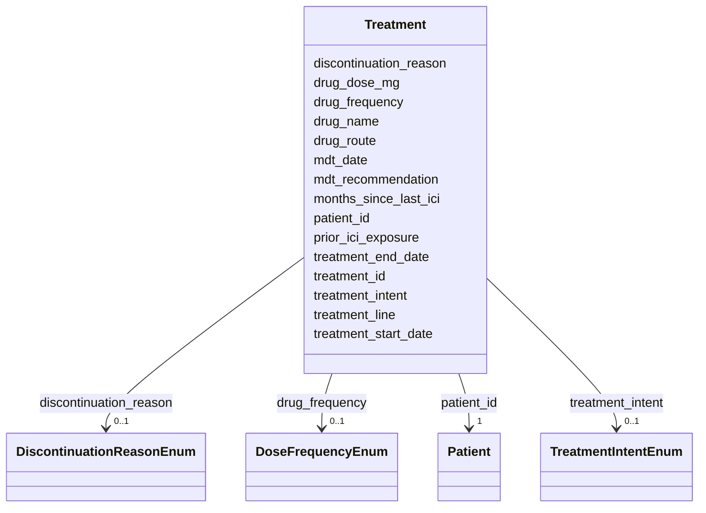

# Class: Treatment 


_Treatment line with drug regimen and duration - multiple rows per patient_


URI: [clinical_model:Treatment](https://uk-cpi.com/clinical_model/Treatment)





<!-- no inheritance hierarchy -->

## Slots

| Name | Cardinality and Range | Description | Inheritance |
| ---  | --- | --- | --- |
| [treatment_id](treatment_id.md) | 1 <br/> [String](String.md) |  | direct |
| [patient_id](patient_id.md) | 1 <br/> [Patient](Patient.md) |  | direct |
| [treatment_line](treatment_line.md) | 0..1 <br/> [Integer](Integer.md) |  | direct |
| [treatment_intent](treatment_intent.md) | 0..1 <br/> [TreatmentIntentEnum](TreatmentIntentEnum.md) |  | direct |
| [drug_name](drug_name.md) | 0..1 <br/> [String](String.md) |  | direct |
| [drug_dose_mg](drug_dose_mg.md) | 0..1 <br/> [Float](Float.md) |  | direct |
| [drug_frequency](drug_frequency.md) | 0..1 <br/> [DoseFrequencyEnum](DoseFrequencyEnum.md) |  | direct |
| [drug_route](drug_route.md) | 0..1 <br/> [String](String.md) |  | direct |
| [treatment_start_date](treatment_start_date.md) | 1 <br/> [Date](Date.md) |  | direct |
| [treatment_end_date](treatment_end_date.md) | 0..1 <br/> [Date](Date.md) |  | direct |
| [mdt_recommendation](mdt_recommendation.md) | 0..1 <br/> [String](String.md) |  | direct |
| [mdt_date](mdt_date.md) | 0..1 <br/> [Date](Date.md) |  | direct |
| [prior_ici_exposure](prior_ici_exposure.md) | 0..1 <br/> [Boolean](Boolean.md) |  | direct |
| [months_since_last_ici](months_since_last_ici.md) | 0..1 <br/> [Float](Float.md) |  | direct |
| [discontinuation_reason](discontinuation_reason.md) | 0..1 <br/> [DiscontinuationReasonEnum](DiscontinuationReasonEnum.md) |  | direct |


## Usages

| used by | used in | type | used |
| ---  | --- | --- | --- |
| [ResponseAssessment](ResponseAssessment.md) | [treatment_id](treatment_id.md) | range | [Treatment](Treatment.md) |


## Identifier and Mapping Information


### Schema Source


* from schema: https://ngdx.org/clinical_model


## Mappings

| Mapping Type | Mapped Value |
| ---  | ---  |
| self | clinical_model:Treatment |
| native | clinical_model:Treatment |


## LinkML Source

<!-- TODO: investigate https://stackoverflow.com/questions/37606292/how-to-create-tabbed-code-blocks-in-mkdocs-or-sphinx -->

### Direct

<details>
```yaml
name: Treatment
description: Treatment line with drug regimen and duration - multiple rows per patient
from_schema: https://ngdx.org/clinical_model
rank: 1000
slots:
- treatment_id
- patient_id
- treatment_line
- treatment_intent
- drug_name
- drug_dose_mg
- drug_frequency
- drug_route
- treatment_start_date
- treatment_end_date
- mdt_recommendation
- mdt_date
- prior_ici_exposure
- months_since_last_ici
- discontinuation_reason
slot_usage:
  treatment_id:
    name: treatment_id
    range: string
  patient_id:
    name: patient_id
    identifier: false

```
</details>

### Induced

<details>
```yaml
name: Treatment
description: Treatment line with drug regimen and duration - multiple rows per patient
from_schema: https://ngdx.org/clinical_model
rank: 1000
slot_usage:
  treatment_id:
    name: treatment_id
    range: string
  patient_id:
    name: patient_id
    identifier: false
attributes:
  treatment_id:
    name: treatment_id
    from_schema: https://ngdx.org/clinical_model
    rank: 1000
    identifier: true
    alias: treatment_id
    owner: Treatment
    domain_of:
    - Treatment
    - ResponseAssessment
    range: string
    required: true
  patient_id:
    name: patient_id
    from_schema: https://ngdx.org/clinical_model
    rank: 1000
    identifier: false
    alias: patient_id
    owner: Treatment
    domain_of:
    - Patient
    - Biopsy
    - Treatment
    - ResponseAssessment
    - ClinicalAssessment
    - ImagingStudy
    range: Patient
    required: true
    pattern: ^NGDX-[0-9]{3}$
  treatment_line:
    name: treatment_line
    from_schema: https://ngdx.org/clinical_model
    rank: 1000
    alias: treatment_line
    owner: Treatment
    domain_of:
    - Treatment
    range: integer
    minimum_value: 0
    maximum_value: 10
  treatment_intent:
    name: treatment_intent
    from_schema: https://ngdx.org/clinical_model
    rank: 1000
    alias: treatment_intent
    owner: Treatment
    domain_of:
    - Treatment
    range: TreatmentIntentEnum
  drug_name:
    name: drug_name
    from_schema: https://ngdx.org/clinical_model
    rank: 1000
    alias: drug_name
    owner: Treatment
    domain_of:
    - Treatment
    range: string
  drug_dose_mg:
    name: drug_dose_mg
    from_schema: https://ngdx.org/clinical_model
    rank: 1000
    alias: drug_dose_mg
    owner: Treatment
    domain_of:
    - Treatment
    range: float
    minimum_value: 0
  drug_frequency:
    name: drug_frequency
    from_schema: https://ngdx.org/clinical_model
    rank: 1000
    alias: drug_frequency
    owner: Treatment
    domain_of:
    - Treatment
    range: DoseFrequencyEnum
  drug_route:
    name: drug_route
    from_schema: https://ngdx.org/clinical_model
    rank: 1000
    alias: drug_route
    owner: Treatment
    domain_of:
    - Treatment
    range: string
  treatment_start_date:
    name: treatment_start_date
    from_schema: https://ngdx.org/clinical_model
    rank: 1000
    alias: treatment_start_date
    owner: Treatment
    domain_of:
    - Treatment
    range: date
    required: true
  treatment_end_date:
    name: treatment_end_date
    from_schema: https://ngdx.org/clinical_model
    rank: 1000
    alias: treatment_end_date
    owner: Treatment
    domain_of:
    - Treatment
    range: date
  mdt_recommendation:
    name: mdt_recommendation
    from_schema: https://ngdx.org/clinical_model
    rank: 1000
    alias: mdt_recommendation
    owner: Treatment
    domain_of:
    - Treatment
    range: string
  mdt_date:
    name: mdt_date
    from_schema: https://ngdx.org/clinical_model
    rank: 1000
    alias: mdt_date
    owner: Treatment
    domain_of:
    - Treatment
    range: date
  prior_ici_exposure:
    name: prior_ici_exposure
    from_schema: https://ngdx.org/clinical_model
    rank: 1000
    alias: prior_ici_exposure
    owner: Treatment
    domain_of:
    - Treatment
    range: boolean
  months_since_last_ici:
    name: months_since_last_ici
    from_schema: https://ngdx.org/clinical_model
    rank: 1000
    alias: months_since_last_ici
    owner: Treatment
    domain_of:
    - Treatment
    range: float
    minimum_value: 0
  discontinuation_reason:
    name: discontinuation_reason
    from_schema: https://ngdx.org/clinical_model
    rank: 1000
    alias: discontinuation_reason
    owner: Treatment
    domain_of:
    - Treatment
    range: DiscontinuationReasonEnum

```
</details>